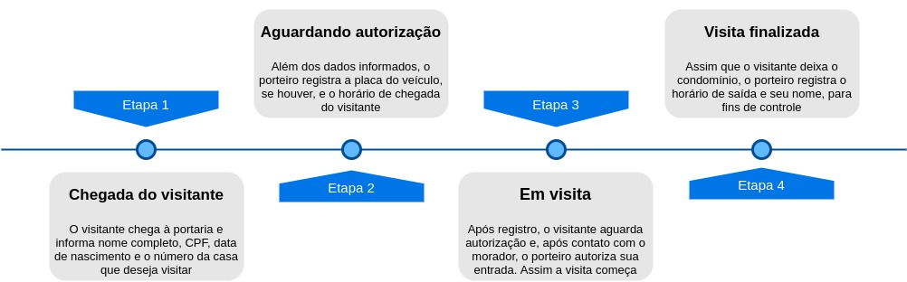

# Home

## Django framework na prática

Todo material aqui apresentado é fruto de um trabalho de alguns meses e serve de guia para o desenvolvimento do curso [Django framework na prática](http://127.0.0.1), além disto, pode ser utilizado como material complementar às aulas disponíveis na plataforma Udemy. Apesar disto, todo o material referente à esta apostila é de uso aberto e pode ser utilizado no aprendizado livre sem a necessidade de qualquer pagamento, contribuição ou até mesmo compra do curso na plataforma.

O objetivo do curso é explorar as principais funcionalidades do framework Django por meio da construção de uma dashboard para registro e administração de visitantes para condomínio. Vamos desenvolver um projeto real e aprender ao longo de seu desenvolvimento o que são as ferramentas que o framework nos dá e como utilizá-las. Seguindo o roteiro aqui apresentado, você vai poder iniciar a sua carreira como desenvolvedor web utilizando a linguagem Python e desenvolver aplicações seguras e escaláveis em tempo record!

Vamos construir juntos uma aplicação web do zero com Python utilizando o framework Django. Essa aplicação consiste num sistema de controle de visitantes para condomínio e ela deverá ser capaz de, basicamente, registrar e administrar os visitantes de um condomínio, além de todas as operações necessárias como autorizar entrada e finalizar as visitas.

Apesar do projeto ser de código aberto e estar sob a licença [MIT](https://opensource.org/licenses/MIT), esta apostila está licenciada sob a licença [Creative Commons Atribuição-NãoComercial-SemDerivações 4.0 Internacional](http://creativecommons.org/licenses/by-nc-nd/4.0/).

## Conhecendo o projeto

O projeto [controle-visitantes](https://github.com/djangoframeworknapratica/controle-visitantes) visa informatizar o processo de registro e administração de visitantes do condomínio Montanhas azuis. Hoje o condomínio conta com um processo manual e por meio de cadernos que são utilizados para registrar as informações referentes aos visitantes e informatizar esse processo é importante para ganhar tempo, melhorar a experiência de trabalho dos porteiros e ainda manter as informações mais seguras.

O projeto consiste em uma página web em que seja possível registrar visitantes e visualizar suas informações. Além disso, precisamos disponibilizar algumas funcionalidades que seguem o fluxo executado pelo porteiro assim que um visitante chega à portaria do condomínio. Na imagem abaixo é possível visualizar o fluxo executado e suas etapas:

Esse processo deve ser mantido, mas podemos melhorar e muito suas etapas...

## Principais funcionalidades

### Registro de visitantes

AAA...

### Listagem de visitantes

AAA...

### Visualização de informações de visitante

AAA...

### Autorização de entrada

AAA...

### Finalização de visita

AAA...

## Tecnologias utilizadas

O projeto [controle-visitantes](https://github.com/djangoframeworknapratica/controle-visitantes) utiliza as seguintes tecnologias e recursos:

* [Django framework](https://www.djangoproject.com/)
* [Django widget tweaks](https://github.com/jazzband/django-widget-tweaks)
* [Start Bootstrap - SB Admin 2](https://github.com/BlackrockDigital/startbootstrap-sb-admin-2)

## Requisitos desejáveis

Para um bom aproveitamento de todo material e atividades aqui propostas, é desejável que você tenha os  seguintes conhecimentos:

* Conhecimentos básicos da linguagem Python
  * Funções
  * Noções de Programação Orientada a Objetos
    * Classes
    * Instância de classe
    * Atributos
    * Métodos
* Conhecimentos básicos em HTML, CSS e JS
  * Noções de [Bootstrap](https://getbootstrap.com/)

