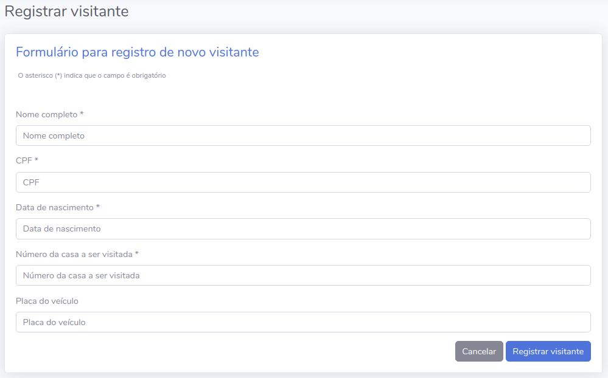
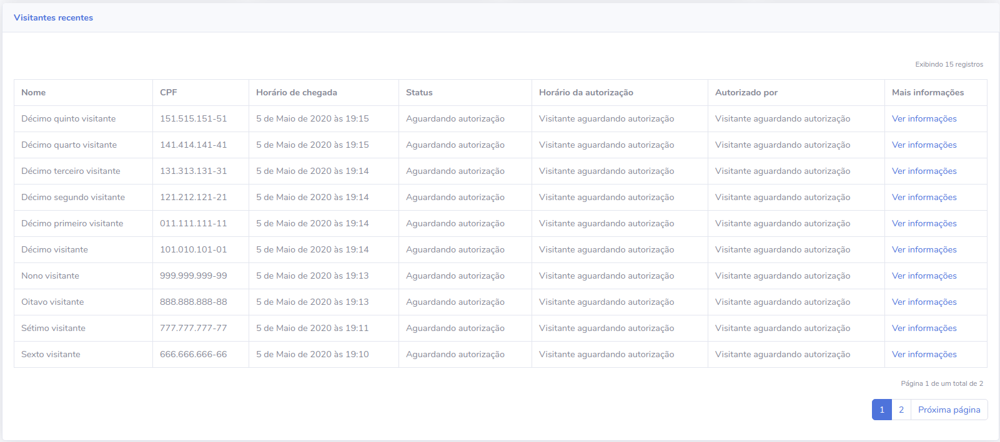
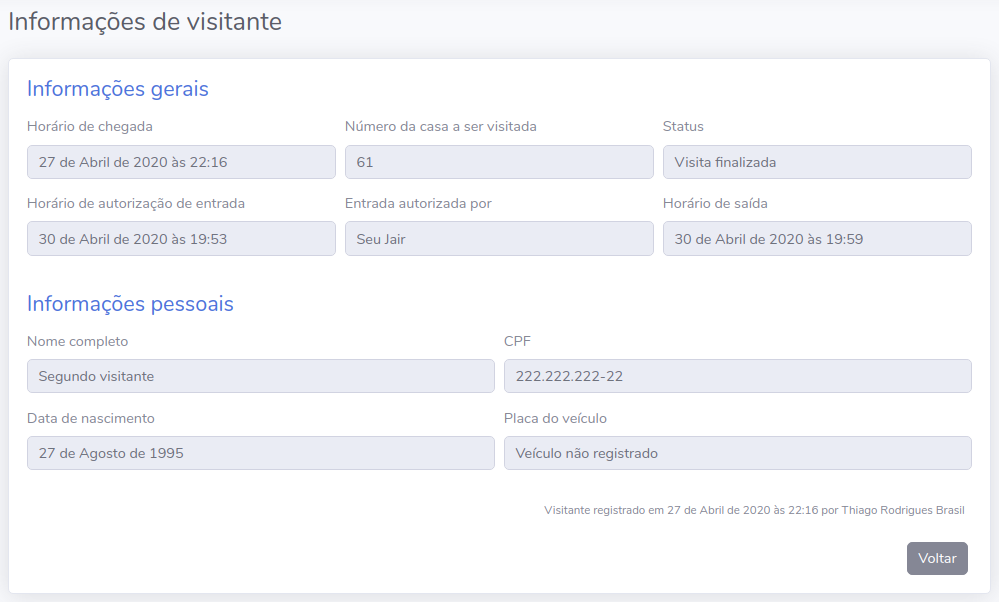
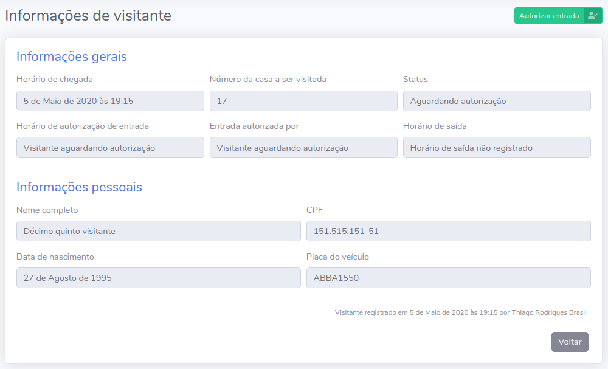
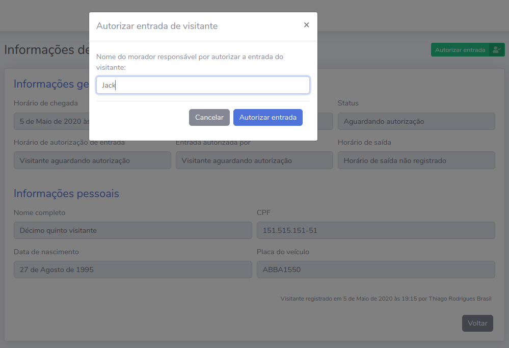
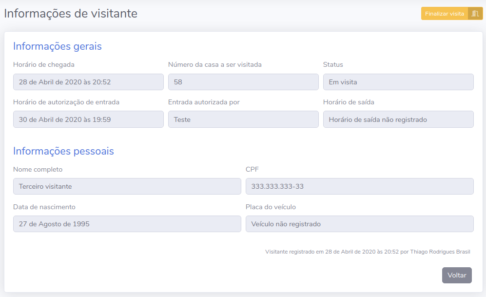
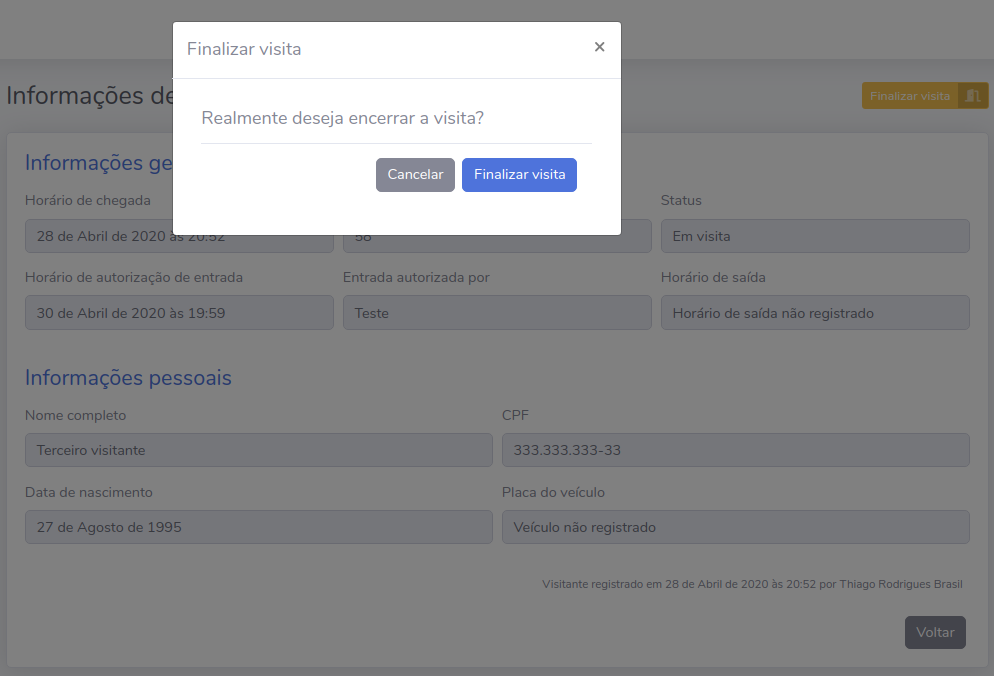

# Home

Todo material aqui apresentado serve de guia para o desenvolvimento do curso [Django framework na prática](http://127.0.0.1) e pode ser utilizado como material complementar às aulas disponíveis na plataforma Udemy. Apesar disto, todo o material referente à esta apostila é de uso aberto e pode ser utilizado no aprendizado livre sem a necessidade de qualquer pagamento, contribuição ou até mesmo compra do curso na plataforma mencionada.

O objetivo do curso é explorar as principais funcionalidades do framework Django por meio da construção de uma dashboard para registro e administração de visitantes de um determinado condomínio. Vamos desenvolver um projeto real e aprender ao longo de seu desenvolvimento o que são as ferramentas que o framework nos dá e como utilizá-las. Seguindo o roteiro aqui apresentado, você vai poder iniciar a sua carreira como desenvolvedor web utilizando a linguagem Python e desenvolver aplicações seguras e escaláveis em tempo recorde.

Esta apostila está licenciada sob a licença [Creative Commons Atribuição-NãoComercial-SemDerivações 4.0 Internacional](http://creativecommons.org/licenses/by-nc-nd/4.0/).

## Conhecendo o processo

O projeto [controle-visitantes](https://github.com/djangoframeworknapratica/controle-visitantes) tem o objetivo informatizar o processo de registro e administração de visitantes do condomínio Montanhas Azuis. 

Hoje o condomínio conta com um processo manual e por meio de cadernos que são utilizados para registrar as informações referentes aos visitantes e informatizar esse processo é importante para ganhar tempo no processo, melhorar a experiência de trabalho dos porteiros e ainda armazenar as informações de forma segura e confiável.

O projeto consiste em uma ou mais páginas web em que seja possível registrar visitantes e visualizar suas informações. Além disso, precisamos disponibilizar algumas funcionalidades que seguem o fluxo executado pelo porteiro assim que um visitante chega à portaria do condomínio.

Na imagem abaixo é possível visualizar o fluxo executado pelos porteiros e suas etapas:

## Principais funcionalidades

### Registro de visitantes

O formulário de registro de visitantes deve abstrair a etapa 01 do processo, onde o visitante informa **nome completo**, **CPF**, **data de nascimento**, o **número da casa** que deseja visitar e ainda a **placa do veículo**, se estiver utilizando durante a visita. Além desta informações, o formulário salva o **horário de chegada** do visitante automaticamente.

### Listagem de visitantes

A listagem de visitantes exibe, por meio de uma tabela, os visitantes recentes classificados por horário de chegada, do mais recente para o mais antigo.

### Visualização de informações de visitante

A partir da tabela que lista os visitantes recentes, é possível acessar a página que exibe as informações detalhadas de cada visitante. No exemplo abaixo um visitante com a visita já finalizada:

### Autorização de entrada

A tela de informações de vistante é importante pois a partir dela é possível utilizar as funcionalidades de autorização de entrada e finalização de visita.

Quando um visitante está aguardando autorização, o botão para autorizar a entrada fica disponível na tela de informações deste visitante e, para autorizar a entrada, basta clicar no botão para abrir o formulário que deve ser preenchido com o nome do morador que autorizou a entrada do visitante e confirmar a ação.

No exemplo a seguir o visitante está aguardando autorização:

Assim como quando o porteiro anotava o nome do morador responsável por autorizar a entrada e o horário de contato com esse morador, a funcionalidade recebe o nome do morador através de um formulário e salva o horário de contato e autorização de forma automática ao concluir a ação.

### Finalização de visita

Assim como conseguimos utilizar a funcionalidade para autorizar a entrada do visitante, podemos finalizar sua visita. A funcionalidade funciona de forma parecida, com a diferença que é necessário apenas confirmar a ação, sem necessidade de informações adicionais.

Ao clicar no botão para finalizar uma visita, um alerta é exibido solicitando que o porteiro confirme a ação.

Ao confirmar a ação clicando no botão "finalizar visita", o porteiro encerra o processo referente a este visitante e o horário em que a ação ocorreu é registrada.

Os botões "autorizar entrada" e "finalizar visita" são exibidos somente quando é possível executar a ação para o visitante em questão. Caso contrário, como quando o visitante já deixou as dependências do condomínio, nenhum botão é exibido.

## Tecnologias utilizadas

O projeto [controle-visitantes](https://github.com/djangoframeworknapratica/controle-visitantes) utiliza as seguintes tecnologias e recursos de código aberto:

* [Django framework](https://www.djangoproject.com/)
* [Django widget tweaks](https://github.com/jazzband/django-widget-tweaks)
* [Start Bootstrap - SB Admin 2](https://github.com/BlackrockDigital/startbootstrap-sb-admin-2)

## Requisitos desejáveis

Para um bom aproveitamento de todo material e atividades aqui propostas, é desejável que você tenha os seguintes conhecimentos:

* Conhecimentos básicos da linguagem Python
  * Funções
  * Noções de Programação Orientada a Objetos
    * Classes
    * Instância de classe
    * Atributos
    * Métodos
* Conhecimentos básicos em HTML, CSS e JS
  * Noções de [Bootstrap](https://getbootstrap.com/)
* Sistema operacional baseado em Unix
* Conhecimentos básicos em terminal

