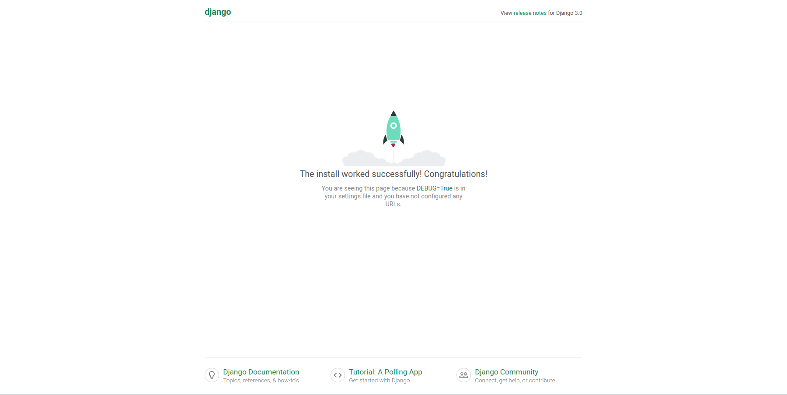

# Capítulo 02

## Iniciando seu primeiro projeto Django

Antes de partimos para todas as atividades que envolvem o desenvolvimento da nossa dashboard, temos que iniciar nosso projeto, claro. Iniciar um projeto significa criar toda a estrutura básica necessária para garantir que o código que a gente vai escrever vai funcionar conforme esperado utilizando as tecnologias escolhidas.  
  
Felizmente, o Django já nos dá alguns scripts que servem para executar tarefas específicas do nosso projeto e, dentre elas, criar o esqueleto de um novo projeto com esse estrutura básica necessária. Ao fim da execução do script, teremos algumas pastas e arquivos que poderão ser alterados conforme nossa necessidade.

Antes de executar os comandos necessários para iniciar projeto, vamos lembrar de ativar o ambiente virtual. Basta acessar a pasta do projeto \(`cd controle-visitantes`\) e utilizar o comando `source` passando caminho `env/bin/activate`:

```bash
$ cd controle-visitantes
$ source env/bin/activate
```

Após a ativação do ambiente, vamos criar um novo projeto utilizando o comando `startproject` do `django-admin`:

```bash
(env)$ django-admin startproject controle_visitantes .
```

O comando `startproject` pode receber, além do nome do projeto, o diretório em que o mesmo deverá ser iniciado \(caso o diretório não seja informado, o Django criará um diretório de mesmo nome do projeto\). Além disso, o Django permite apenas letras, números e o underline em nomes de projetos, por isso a pasta se chama `controle-visitantes` e o projeto `controle_visitantes`. Com o comando acima estamos iniciando nosso projeto com nome `controle_visitantes` na pasta em que estamos trabalhando, isto é, na pasta `controle-visitantes` \(note o ponto especificando o diretório atual\).

### Um pouco mais sobre o django-admin

O `django-admin` é um pacote de comandos úteis para realização de tarefas administrativas dentro da aplicação e dispõe de comandos para criar um novo projeto, iniciar o servidor de desenvolvimento, verificar erros e muito mais. Em complemento ao `django-admin`, o arquivo `manage.py` é criado.

O `manage.py` funciona exatamente como o `django-admin`. Na verdade, eles são a mesma coisa, com a diferença que que o `manage.py`, por baixo dos panos, define um arquivo de configurações para ser utilizado pelo servidor de desenvolvimento. Em geral, o arquivo de configurações do nosso projeto.

Como o Django já possui um servidor de desenvolvimento integrado que nos possibilita rodar a aplicação localmente, vamos iniciá-lo e verificar se está tudo funcionando conforme esperado. Para isso, vamos utilizar o seguinte comando:

```bash
(env)$ python manage.py runserver
```


Por enquanto, vamos ignorar os avisos referentes às migrações de banco de dados. Em breve vamos entender melhor do que se trata.


Com o servidor de desenvolvimento rodando, vamos acessar o endereço [http://127.0.0.1:8000/](http://127.0.0.1:8000/). Caso a tela abaixo apareça, significa que está tudo funcionando corretamente.



## Entendendo a estrutura do projeto

Como vimos anteriormente, o `django-admin` cria o esqueleto de um novo projeto e é isso que nós vamos entender agora: a estrutura que foi criada. Antes de tudo, vamos abrir a pasta do projeto em um editor de código. Eu vou utilizar o [VS Code](https://code.visualstudio.com/), mas fique livre para escolher o seu favorito.

Com a pasta do projeto aberta no editor de código, vamos passar por cada um dos arquivos criados e entender o motivo pelo qual estão aí. A lista é a seguinte:

```text
controle-visitantes/    
    manage.py    
    controle_visitantes/
        asgi.py
        __init__.py
        settings.py
        urls.py
        wsgi.py
```

* O primeiro diretório nomeado `controle-visitantes/` é apenas um container para armazenar os arquivos do nosso projeto. O nome desse diretório não é importante para o Django e pode ser alterado a qualquer momento. 
* O arquivo `manage.py` é um utilitário de linha de comando que permite que a gente interaja com o projeto Django de diversas maneiras, conforme vimos anteriormente. 
* O segundo diretório nomeado `controle_visitantes/` é o diretório que agrupa o pacote Python referente ao nosso projeto. O nome do diretório é o nome do nosso pacote e ele é importante pois nos auxilia no processo de importação de arquivos e funções. Sendo assim, alterar o nome deste diretório nos trará sérios problemas. 
* O arquivo `controle_visitantes/__init__.py` é um arquivo vazio que diz ao Python que aquele diretório deve ser reconhecido e tratado como um pacote. 
* O arquivo `controle_visitantes/settings.py` é o arquivo de configurações do nosso projeto Django. Nele nós podemos detalhar como o projeto funciona e quais definições estão disponíveis. 
* O arquivo `controle_visitantes/urls.py` é o arquivo que declara as URLs do nosso projeto. Para que uma URL do nosso projeto seja acessível através do navegador, temos que declará-la neste arquivo. 
* O arquivo `controle_visitantes/wsgi.py` é um ponto de integração para servidores web que implementam o WSGI, um padrão Python que descreve como os servidores devem se comunicar com as aplicações web. 
* Já o arquivo `controle_visitantes/asgi.py` é o ponto de integração para servidores web utilizarem comunicação assíncrona


A partir da versão 3.0 o Django passou a dar suporte a alguns padrões de comunicação assíncrona


## Criando nosso primeiro aplicativo Django

Agora que o ambiente de desenvolvimento está configurado, é hora da gente começar a colocar a mão na massa!

Conforme vimos, um projeto Django nada mais é que um pacote Python que deve seguir algumas convenções, como nomenclatura de arquivos e diretórios. O mesmo, obviamente, se estende para os aplicativos deste projeto. Sendo assim, devemos seguir uma estrutura básica dentro dos nossos aplicativos, que nada mais são que outros pacotes Python. A diferença básica entre eles é que um aplicativo deve executar uma tarefa em específico, como o gerenciamento de usuários do sistema, e um projeto é, na verdade, um conjunto de configurações e aplicativos que executam tarefas distintas. Um projeto pode ter vários aplicativos e um aplicativo pode estar presente em vários projetos.

Felizmente, podemos usar o nosso bom e velho amigo `manage.py` para nos auxiliar nessa tarefa de criar toda a estrutura necessária para um novo aplicativo. Para criar nossos aplicativos podemos utilizar o comando `startapp` passando o nome do aplicativo que deverá ser criado:

```bash
(env)$ python manage.py startapp usuarios
```

Após o comando ser executado, uma nova pasta, com o nome escolhido \(usuarios\), será criada dentro do projeto. Essa pasta terá a seguinte estrutura, que vamos entender melhor no decorrer das aulas:

```text
usuarios/
    __init__.py
    admin.py
    apps.py
    migrations/
        __init__.py
    models.py
    tests.py
    views.py
```

Todos os aplicativos do seu projeto Django terão essa mesma estrutura devido às convenções e padrões que falamos anteriormente. Esses padrões são legais pois nos ajudam a manter uma certa organização, o que nos facilita bastante em casos de manutenções e deixa nosso código mais previsível.

Antes de começarmos a trabalhar no código de um novo aplicativo, temos que registrá-lo nas configurações do nosso projeto para que o mesmo seja reconhecido. Caso esse passo não seja executado, o projeto não saberá que a pasta `usuarios` é um aplicativo do projeto.

Vamos abrir o arquivo `settings.py` no diretório principal do projeto e procurar pela variável `INSTALLED_APPS`. Essa variável guarda o nome dos aplicativos que são utilizados no projeto. Por padrão, o Django já começa utilizando alguns aplicativos do próprio framework, como `admin`, `auth`, `sessions` e `messages`, cada um com uma finalidade específica.

```python
INSTALLED_APPS = [
    "django.contrib.admin",
    "django.contrib.auth",
    "django.contrib.contenttypes",
    "django.contrib.sessions",
    "django.contrib.messages",
    "django.contrib.staticfiles",
]
```

Para registrar nosso aplicativo, basta colocarmos ele no final dessa lista e o Django fará todo o resto. Para manter uma melhor organização, vamos separar os aplicativos do Django dos nossos aplicativos nessa configuração. Para isso, basta inserir o código abaixo logo após a variável `INSTALLED_APPS`. 

```python
INSTALLED_APPS += [
    "usuarios",
]
```

Note que estamos utilizando um operador de atribuição diferente, sendo `+=` ao invés de `=`. Esse operador faz com que o valor existente na variável seja mantido e a gente acrescente o valor à direita do operador. Isto é, estamos mantendo os aplicativos do Django e adicionando os nossos. O código que teremos será o seguinte:

```python
INSTALLED_APPS = [
    "django.contrib.admin",
    "django.contrib.auth",
    "django.contrib.contenttypes",
    "django.contrib.sessions",
    "django.contrib.messages",
    "django.contrib.staticfiles",
]

INSTALLED_APPS += [
    "usuarios",
]
```

## Escrevendo nosso "Hello World"

O "Hello world" \(ou "Olá mundo"\) é aquele famoso programa de computador que imprime na tela o texto "Hello world" e é sempre utilizado como exemplo minimalista de determinada linguagem ou framework. Não vamos deixar a tradição de lado e vamos implementar a nossa versão do programa em Django. A diferença é que, como estamos trabalhando na web, vamos exibir o texto no navegador, acessando a URL que vamos configurar. Mão na massa!

Vamos começar trabalhando no arquivo `views.py` do nosso aplicativo `usuarios`. A camada view é responsável por encapsular a lógica que recebe e responde as requisições dos nossos usuários, podendo ou não definir comportamentos específicos e buscar informações no banco de dados, por exemplo. Toda view no Django é uma função de retorno vinculada a uma URL específica. Sendo assim, não existe uma URL sem uma função de view.

```python
from django.shortcuts import render
from django.http import HttpResponse

def index(request):
    return HttpResponse("Hello world")
```

Essa é o exemplo mais básico de view que podemos escrever no Django. Ela apenas retorna um objeto do tipo `HttpResponse` que nada mais é, neste caso, que um texto simples.

Com a nossa função de view pronta, temos agora que mapear ela para ser chamada junto à uma URL. Para isso, vamos alterar o arquivo `urls.py` no diretório principal do nosso projeto. O arquivo terá um conteúdo parecido com o abaixo:

```python
from django.urls import path
from django.contrib import admin

urlpatterns = [
    path("admin/", admin.site.urls),
]
```

O primeiro passo será importar o arquivo de views do nosso aplicativo `usuarios` e depois adicionar uma nova linha na lista `urlpatterns`. Vamos substituir o conteúdo do arquivo pelo seguinte código:

```python
from django.urls import path
from django.contrib import admin

from usuarios.views import index

urlpatterns = [
    path("admin/", admin.site.urls),
    
    path(
        "",
        index,
        name="index"
    ),
]
```

A função `path` recebe uma string que será a URL a ser acessada no navegador, uma função a ser executada e um nome para a URL ser identificada mais facilmente dentro do projeto. O nome da URL é bem útil para casos onde temos que renderizar o endereço completo da URL no template ou direcionar o usuário para uma página específica, por exemplo. Em breve vamos aprender mais sobre.

Feito isso, vamos utilizar o comando para iniciar nosso servidor de desenvolvimento e ver o que aparece ao acessarmos o endereço através do navegador.

```bash
(env)$ python manage.py runserver
```

Feito isso e não havendo erros no terminal, você deverá acessar o endereço [`http://127.0.0.1:8000/`](http://127.0.0.1:8000/) em seu navegador e visualizar nosso tão esperado "Hello world".

