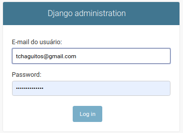
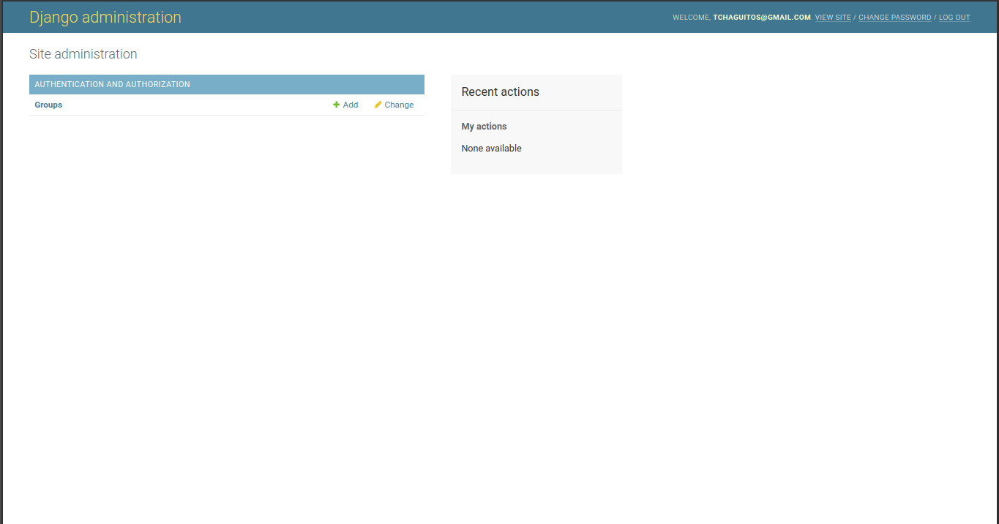
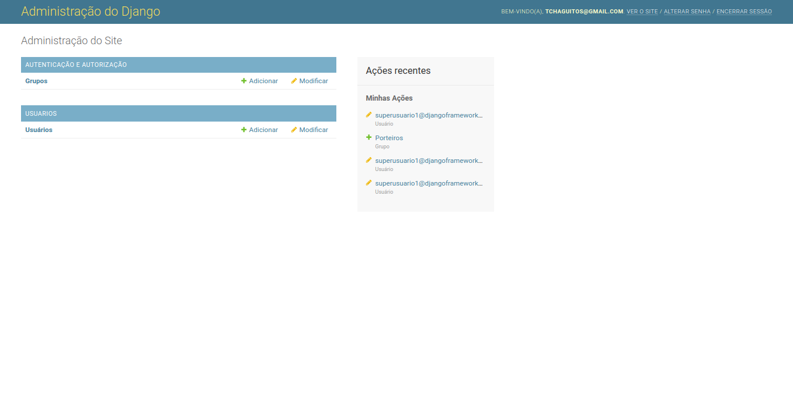

# Capítulo 02

## Iniciando seu primeiro projeto Django

Antes de partimos para todas as atividades que envolvem o desenvolvimento da nossa dashboard, temos que iniciar nosso projeto, claro. Iniciar um projeto significa criar toda a estrutura básica necessária para garantir que o código que a gente vai escrever vai funcionar conforme esperado utilizando as tecnologias escolhidas.  
  
Felizmente, o Django já nos dá alguns scripts que servem para executar tarefas específicas do nosso projeto e, dentre elas, criar o esqueleto de um novo projeto com esse estrutura básica necessária. Ao fim da execução do script, teremos algumas pastas e arquivos que poderão ser alterados conforme nossa necessidade.

Antes de executar os comandos necessários para iniciar projeto, vamos lembrar de ativar o ambiente virtual. Basta acessar a pasta do projeto \(`cd controle-visitantes`\) e utilizar o comando `source` passando caminho `env/bin/activate`:

```bash
$ cd controle-visitantes
$ source env/bin/activate
```

Após a ativação do ambiente, vamos criar um novo projeto utilizando o comando `startproject` do `django-admin`:

```bash
(env)$ django-admin startproject controle_visitantes .
```

O comando `startproject` pode receber, além do nome do projeto, o diretório em que o mesmo deverá ser iniciado \(caso o diretório não seja informado, o Django criará um diretório de mesmo nome do projeto\). Além disso, o Django permite apenas letras, números e o underline em nomes de projetos, por isso a pasta se chama `controle-visitantes` e o projeto `controle_visitantes`. Com o comando acima estamos iniciando nosso projeto com nome `controle_visitantes` na pasta em que estamos trabalhando, isto é, na pasta `controle-visitantes` \(note o ponto especificando o diretório atual\).

### Um pouco mais sobre o django-admin

O `django-admin` é um pacote de comandos úteis para realização de tarefas administrativas dentro da aplicação e dispõe de comandos para criar um novo projeto, iniciar o servidor de desenvolvimento, verificar erros e muito mais. Em complemento ao `django-admin`, o arquivo `manage.py` é criado.

O `manage.py` funciona exatamente como o `django-admin`. Na verdade, eles são a mesma coisa, com a diferença que que o `manage.py`, por baixo dos panos, define um arquivo de configurações para ser utilizado pelo servidor de desenvolvimento. Em geral, o arquivo de configurações do nosso projeto.

Como o Django já possui um servidor de desenvolvimento integrado que nos possibilita rodar a aplicação localmente, vamos iniciá-lo e verificar se está tudo funcionando conforme esperado. Para isso, vamos utilizar o seguinte comando:

```bash
(env)$ python manage.py runserver
```


Por enquanto, vamos ignorar os avisos referentes às migrações de banco de dados. Em breve vamos entender melhor do que se trata.


Com o servidor de desenvolvimento rodando, vamos acessar o endereço [http://127.0.0.1:8000/](http://127.0.0.1:8000/). Caso a tela abaixo apareça, significa que está tudo funcionando corretamente.


## Entendendo a estrutura do projeto

Como vimos anteriormente, o `django-admin` cria o esqueleto de um novo projeto e é isso que nós vamos entender agora: a estrutura que foi criada. Antes de tudo, vamos abrir a pasta do projeto em um editor de código. Eu vou utilizar o [VS Code](https://code.visualstudio.com/), mas fique livre para escolher o seu favorito.

Com a pasta do projeto aberta no editor de código, vamos passar por cada um dos arquivos criados e entender o motivo pelo qual estão aí. A lista é a seguinte:

```text
controle-visitantes/    
    manage.py    
    controle_visitantes/
        asgi.py
        __init__.py
        settings.py
        urls.py
        wsgi.py
```

* O primeiro diretório nomeado `controle-visitantes/` é apenas um container para armazenar os arquivos do nosso projeto. O nome desse diretório não é importante para o Django e pode ser alterado a qualquer momento. 
* O arquivo `manage.py` é um utilitário de linha de comando que permite que a gente interaja com o projeto Django de diversas maneiras, conforme vimos anteriormente. 
* O segundo diretório nomeado `controle_visitantes/` é o diretório que agrupa o pacote Python referente ao nosso projeto. O nome do diretório é o nome do nosso pacote e ele é importante pois nos auxilia no processo de importação de arquivos e funções. Sendo assim, alterar o nome deste diretório nos trará sérios problemas. 
* O arquivo `controle_visitantes/__init__.py` é um arquivo vazio que diz ao Python que aquele diretório deve ser reconhecido e tratado como um pacote. 
* O arquivo `controle_visitantes/settings.py` é o arquivo de configurações do nosso projeto Django. Nele nós podemos detalhar como o projeto funciona e quais definições estão disponíveis. 
* O arquivo `controle_visitantes/urls.py` é o arquivo que declara as URLs do nosso projeto. Para que uma URL do nosso projeto seja acessível através do navegador, temos que declará-la neste arquivo. 
* O arquivo `controle_visitantes/wsgi.py` é um ponto de integração para servidores web que implementam o WSGI, um padrão Python que descreve como os servidores devem se comunicar com as aplicações web. 
* Já o arquivo `controle_visitantes/asgi.py` é o ponto de integração para servidores web utilizarem comunicação assíncrona


A partir da versão 3.0 o Django passou a dar suporte a alguns padrões de comunicação assíncrona


## Criando nosso primeiro aplicativo Django

Agora que o ambiente de desenvolvimento está configurado, é hora da gente começar a colocar a mão na massa!

Conforme vimos, um projeto Django nada mais é que um pacote Python que deve seguir algumas convenções, como nomenclatura de arquivos e diretórios. O mesmo, obviamente, se estende para os aplicativos deste projeto. Sendo assim, devemos seguir uma estrutura básica dentro dos nossos aplicativos, que nada mais são que outros pacotes Python. A diferença básica entre eles é que um aplicativo deve executar uma tarefa em específico, como o gerenciamento de usuários do sistema, e um projeto é, na verdade, um conjunto de configurações e aplicativos que executam tarefas distintas. Um projeto pode ter vários aplicativos e um aplicativo pode estar presente em vários projetos.

Felizmente, podemos usar o nosso bom e velho amigo `manage.py` para nos auxiliar nessa tarefa de criar toda a estrutura necessária para um novo aplicativo. Para criar nossos aplicativos podemos utilizar o comando `startapp` passando o nome do aplicativo que deverá ser criado:

```bash
(env)$ python manage.py startapp usuarios
```

Após o comando ser executado, uma nova pasta, com o nome escolhido \(usuarios\), será criada dentro do projeto. Essa pasta terá a seguinte estrutura, que vamos entender melhor no decorrer das aulas:

```text
usuarios/
    __init__.py
    admin.py
    apps.py
    migrations/
        __init__.py
    models.py
    tests.py
    views.py
```

Todos os aplicativos do seu projeto Django terão essa mesma estrutura devido às convenções e padrões que falamos anteriormente. Esses padrões são legais pois nos ajudam a manter uma certa organização, o que nos facilita bastante em casos de manutenções e deixa nosso código mais previsível.

Antes de começarmos a trabalhar no código de um novo aplicativo, temos que registrá-lo nas configurações do nosso projeto para que o mesmo seja reconhecido. Caso esse passo não seja executado, o projeto não saberá que a pasta `usuarios` é um aplicativo do projeto.

Vamos abrir o arquivo `settings.py` no diretório principal do projeto e procurar pela variável `INSTALLED_APPS`. Essa variável guarda o nome dos aplicativos que são utilizados no projeto. Por padrão, o Django já começa utilizando alguns aplicativos do próprio framework, como `admin`, `auth`, `sessions` e `messages`, cada um com uma finalidade específica.

```python
INSTALLED_APPS = [
    "django.contrib.admin",
    "django.contrib.auth",
    "django.contrib.contenttypes",
    "django.contrib.sessions",
    "django.contrib.messages",
    "django.contrib.staticfiles",
]
```

Para registrar nosso aplicativo, basta colocarmos ele no final dessa lista e o Django fará todo o resto. Para manter uma melhor organização, vamos separar os aplicativos do Django dos nossos aplicativos nessa configuração. Para isso, basta inserir o código abaixo logo após a variável `INSTALLED_APPS`. 

```python
INSTALLED_APPS += [
    "usuarios",
]
```

Note que estamos utilizando um operador de atribuição diferente, sendo `+=` ao invés de `=`. Esse operador faz com que o valor existente na variável seja mantido e a gente acrescente o valor à direita do operador. Isto é, estamos mantendo os aplicativos do Django e adicionando os nossos. O código que teremos será o seguinte:

```python
INSTALLED_APPS = [
    "django.contrib.admin",
    "django.contrib.auth",
    "django.contrib.contenttypes",
    "django.contrib.sessions",
    "django.contrib.messages",
    "django.contrib.staticfiles",
]

INSTALLED_APPS += [
    "usuarios",
]
```

## Escrevendo nosso "Hello World"

O "Hello world" \(ou "Olá mundo"\) é aquele famoso programa de computador que imprime na tela o texto "Hello world" e é sempre utilizado como exemplo minimalista de determinada linguagem ou framework. Não vamos deixar a tradição de lado e vamos implementar a nossa versão do programa em Django. A diferença é que, como estamos trabalhando na web, vamos exibir o texto no navegador, acessando a URL que vamos configurar. Mão na massa!

Vamos começar trabalhando no arquivo `views.py` do nosso aplicativo `usuarios`. A camada view é responsável por encapsular a lógica que recebe e responde as requisições dos nossos usuários, podendo ou não definir comportamentos específicos e buscar informações no banco de dados, por exemplo. Toda view no Django é uma função de retorno vinculada a uma URL específica. Sendo assim, não existe uma URL sem uma função de view.

```python
from django.shortcuts import render
from django.http import HttpResponse

def index(request):
    return HttpResponse("Hello world")
```

Essa é o exemplo mais básico de view que podemos escrever no Django. Ela apenas retorna um objeto do tipo `HttpResponse` que nada mais é, neste caso, que um texto simples.

Com a nossa função de view pronta, temos agora que mapear ela para ser chamada junto à uma URL. Para isso, vamos alterar o arquivo `urls.py` no diretório principal do nosso projeto. O arquivo terá um conteúdo parecido com o abaixo:

```python
from django.urls import path
from django.contrib import admin

urlpatterns = [
    path("admin/", admin.site.urls),
]
```

O primeiro passo será importar o arquivo de views do nosso aplicativo `usuarios` e depois adicionar uma nova linha na lista `urlpatterns`. Vamos substituir o conteúdo do arquivo pelo seguinte código:

```python
from django.urls import path
from django.contrib import admin

from usuarios.views import index

urlpatterns = [
    path("admin/", admin.site.urls),
    
    path(
        "",
        index,
        name="index"
    ),
]
```

A função `path` recebe uma string que será a URL a ser acessada no navegador, uma função a ser executada e um nome para a URL ser identificada mais facilmente dentro do projeto. O nome da URL é bem útil para casos onde temos que renderizar o endereço completo da URL no template ou direcionar o usuário para uma página específica, por exemplo. Em breve vamos aprender mais sobre.

Feito isso, vamos utilizar o comando para iniciar nosso servidor de desenvolvimento e ver o que aparece ao acessarmos o endereço através do navegador.

```bash
(env)$ python manage.py runserver
```

Feito isso e não havendo erros no terminal, você deverá acessar o endereço [`http://127.0.0.1:8000/`](http://127.0.0.1:8000/) em seu navegador e visualizar nosso tão esperado "Hello world".

## Escrevendo as models

### Escrevendo a classe modelo

A camada _model_ do nosso projeto, representada pelos arquivos `models.py`, nada mais é que uma representação exata do nosso banco de dados, sendo a classe uma tabela e seus atributos os campos dessa tabela. É nessa camada que guardamos as informações que serão disponibilizadas para outras camadas. Como o Django segue o princípio DRY - _don't repeat yourself_ \(algo tipo "não se repita"\), o objetivo é definir o modelo de dados em um único lugar e automaticamente derivar informações e regras de negócio a partir dele.

O aplicativo `usuarios` será responsável por gerenciar os usuários do sistema. Ou seja, como vamos salvar as credenciais, quais credenciais vamos utilizar e tudo mais. Nesse ponto, é importante dizer que o Django já fornece um modelo padrão para usuários do sistema muito bom e útil para diversos cenários, mas que não dispõe de um suporte amigável para customizações. Se a gente precisar utilizar um e-mail ao invés de um nome de usuário para acessar o sistema, encontraríamos problemas com o modelo fornecido por padrão. Sendo assim, vamos criar nosso modelo personalizado para que seja possível disponibilizar o acesso à dashboard via e-mail.

O próprio Django, em sua documentação, cita exemplos em que o modelo padrão não é o mais apropriado e recomenda alternativas para contornar o problema. Uma das alternativas é sobrescrever o modelo padrão por outro que será definido por nós. Para isso, começaremos alterando o arquivo `models.py` dentro do diretório do nosso aplicativo de nome `usuarios`.

Ao abrir o arquivo, vamos apagar o conteúdo que foi colocado pelo Django e começar importando as classes `BaseUserManager`, `AbstractUser` e `PermissionsMixin`. Estas classes vão nos auxiliar na tarefa de criar um novo modelo para usuários em nosso projeto.

```python
from django.db import models
from django.contrib.auth.models import (
    BaseUserManager,
    AbstractBaseUser,
    PermissionsMixin,
)
```

Vamos começar criando nossa classe `Usuario` como subclasse de `AbstractBaseUser` e `PermissionsMixin` e definir o atributo `e-mail`.

```python
class Usuario(AbstractBaseUser, PermissionsMixin):

    email = models.EmailField(
        verbose_name="E-mail do usuário",
        max_length=194,
        unique=True,
    )
    
```


Existem inúmeros tipos de campos que o Django traz por padrão, sendo eles classes contidas no pacote models do Django. O EmailField é apenas um deles e no decorrer do curso vamos conhecer mais deles.


Após definirmos o atributo `email`, vamos definir alguns outros que são obrigatórios para um modelo de usuário do Django, os campos `is_active`, `is_staff` e `is_superuser`. Vamos aproveitar também para criar a variável `USERNAME_FIELD` que é quem especifica para o Django qual campo deve ser utilizado como nome de usuário que, no nosso caso, é o campo `email`.

```python
class Usuario(AbstractBaseUser, PermissionsMixin):

    email = models.EmailField(
        verbose_name="E-mail do usuário",
        max_length=254,
        unique=True,
    )
    
    is_active = models.BooleanField(
        verbose_name="Usuario ativo?",
        default=True
    )
        
    is_staff = models.BooleanField(
        verbose_name="Usuário é da equipe de desenvolvimento?",
        default=False
    )

    is_superuser = models.BooleanField(
        verbose_name="Usuário é um superusuário?"
        default=False
    )
    
    USERNAME_FIELD = "email"
    
    class Meta:
        verbose_name = "Usuário"
        verbose_name_plural = "Usuários"
        db_table = "usuario"
    
    def __str__(self):
        return self.email
```

Após a definição destes campos e variáveis, vamos escrever uma classe interna à classe `Usuario` chamada `Meta`. Essa classe é comum a todos os modelos e serve para que a gente informe ao Django metadados. Existem diversas opções de metadados que podemos explicitar mas, por hora, vamos nos concentrar no `verbose_name`, `verbose_name_plural` e `db_table.` Estas opções deixam claro para o Django como ele deve apelidar o model, qual o apelido no plural e o nome da tabela no banco de dados referente ao model criado.

Vamos escrever também o método `__str__`. Esse método é obrigatório e chamado sempre que transformamos o objeto numa string para fins de exibição. Um dos casos em que isso ocorre é quando o Django precisa exibir a instância no _Django Admin_ \(não se preocupe com esse nome agora, vamos conhecê-lo melhor em breve\). Sendo assim, seu método `__str__` deve sempre retornar um texto fácil e de rápida identificação para seres humanos. Feito isso, podemos partir para o segundo passo!

### Escrevendo um manager personalizado

O segundo passo para substituirmos o modelo de usuários padrão do Django é criarmos uma subclasse de `BaseUserManager` e sobrescrevermos os métodos `create_user` e `create_superuser`. Estes métodos são responsáveis por criar usuários e super usuários em nosso sistema e devem ser sobrescritos para se adequarem às nossas necessidades. Devido ao fato de estarmos estabelecendo uma relação de herança entre `UsuarioManager` e `BaseUserManager`, não precisamos implementar todos os atributos e métodos, pois estas informações são repassadas à classe filho. 

Uma classe _manager_ é uma interface que fornece informações sobre e como as queries devem ser executadas pela classe modelo quando houver interação com o banco de dados. Para cada classe modelo, existe pelo menos um _manager_.

Vamos escrever nossa classe _manager_ em cima da classe `Usuario`:

```python
class UsuarioManager(BaseUserManager):

    def create_user(self, email, password=None):
        usuario = self.model(
            email=self.normalize_email(email),
        )

        usuario.is_active = True
        usuario.is_staff = False
        usuario.is_superuser = False

        if password:
            usuario.set_password(password)

        usuario.save()

        return usuario
    
    def create_superuser(self, email, password):
        usuario = self.create_user(
            email=self.normalize_email(email),
            password=password,
        )
        
        usuario.is_active = True
        usuario.is_staff = True
        usuario.is_superuser = True
        
        usuario.set_password(password)
        usuario.save()
        
        return usuario

class Usuario(models.Model):
    # código abaixo omitido...
```

Com a classe e métodos escritos, agora temos um _manager_ com a função de criar usuários conforme a nossa necessidade. Com isso, nosso sistema está quase pronto para criar usuários, faltando apenas explicitar que a classe modelo deve utilizar este _manager_ como padrão. Para isso, vamos adicionar um atributo na classe modelo com o nome do manager que queremos utilizar.

O Django utiliza o nome `objects` para o manager padrão da classe, sendo assim, vamos apenas sobrescrever o manager padrão pelo que nós criamos. Vamos criar o atributo `objects` na classe `Usuario` atribuindo a ele a classe `UsuarioManager`.

```python
class Usuario(AbstractBaseUser, PermissionsMixin):
    email = models.EmailField(
        verbose_name="E-mail do usuário",
        max_length=254,
        unique=True,
    )
    
    is_active = models.BooleanField(
        "usuario ativo?",
        default=True
    )
        
    is_staff = models.BooleanField(
        "usuario é da equipe de desenvolvimento?",
        default=False
    )

    is_superuser = models.BooleanField(
        "usuario é um superusuário?",
        default=False
    )
    
    USERNAME_FIELD = "email"
    
    objects = UsuarioManager()
    
    class Meta:
        verbose_name="Usuário"
        verbose_name_plural = "Usuários"
        db_table = "usuario"
    
    def __str__(self):
        return self.email
```

### Alterando o modelo padrão nas configurações

Para dizermos ao Django que ele deve utilizar a nossa classe modelo ao invés do modelo padrão para usuários do sistema, temos que adicionar a variável `AUTH_USER_MODEL` ao arquivo `settings.py` e apontar para a classe a ser utilizada. 

```python
AUTH_USER_MODEL = "usuarios.Usuario"
```


Ao escrevermos isso, estamos dizendo "hey, Django, use a classe Usuario do aplicativo usuarios como modelo de usuários do sistema".


### Criando as tabelas do nosso banco de dados

Com o trecho de código que escrevemos o Django já é capaz de executar instruções para criação da tabela `usuario` no nosso banco de dados e disponibilizar uma API de acesso aos objetos do tipo `Usuario,` mas antes precisamos avisar ao Django a respeito destas alterações. Sempre que ocorrer alguma alteração nos modelos ou você criar um novo modelo, é necessário avisar ao Django para que ele cuide de toda a parte anterior à efetivação das mudanças no banco de dados.

Para isso, quando escrevemos uma classe modelo, temos que executar o comando `makemigrations`. Esse comando vai criar um arquivo de migração contendo todas as alterações que devem ser feitas no banco de dados, tais como criação de tabelas com determinados atributos, alteração nos atributos, dentre outros. Vamos executar o seguinte comando:

```bash
(env)$ python manage.py makemigrations usuarios
```

Ao executar o comando `makemigrations`, você está dizendo ao Django para armazenar as alterações realizadas em forma de _migração_. Uma _migração_ nada mais é que um arquivo de texto contendo todos os passos que devem ser executados para efetivação das alterações no banco de dados. Aparecerá algo como isso na tela do terminal:

```text
Migrations for 'usuarios':
  usuarios/migrations/0001_initial.py
    - Create model Usuario
```

Existe também um comando para rodar as migrações e gerenciar o _schema_ do banco de dados de forma automática. O comando `migrate` é quem vai reunir todas as migrações que ainda não foram executadas e aplicar elas em seu banco de dados - isto é, vai sincronizar seu banco de dados com as informações que estão na classe modelo. Para efetuar as alterações em nosso banco de dados vamos executar o comando:

```bash
(env)$ python manage.py migrate
```

Migrações são um recurso poderoso pois nos permitem alterar as classes modelos ao longo do tempo sem a necessidade de manipular nosso banco de dados. O comando `migrate` é especialista em atualizar nosso banco de dados em tempo real sem perder dados.

```text
Operations to perform:
  Apply all migrations: admin, auth, contenttypes, sessions, usuarios

Running migrations:
  Applying contenttypes.0001_initial... OK
  Applying contenttypes.0002_remove_content_type_name... OK
  Applying auth.0001_initial... OK
  Applying auth.0002_alter_permission_name_max_length... OK
  Applying auth.0003_alter_user_email_max_length... OK
  Applying auth.0004_alter_user_username_opts... OK
  Applying auth.0005_alter_user_last_login_null... OK
  Applying auth.0006_require_contenttypes_0002... OK
  Applying auth.0007_alter_validators_add_error_messages... OK
  Applying auth.0008_alter_user_username_max_length... OK
  Applying auth.0009_alter_user_last_name_max_length... OK
  Applying auth.0010_alter_group_name_max_length... OK
  Applying auth.0011_update_proxy_permissions... OK
  Applying usuarios.0001_initial... OK
  Applying admin.0001_initial... OK
  Applying admin.0002_logentry_remove_auto_add... OK
  Applying admin.0003_logentry_add_action_flag_choices... OK
  Applying sessions.0001_initial... OK
```

Não se assuste com as tantas letras que vão aparecer no terminal. Elas nos informam quais aplicativos tiveram operações executadas e quais arquivos de migração foram utilizados para a migração em questão.

Agora temos nosso modelo personalizado de usuários criado e ativado em nosso banco de dados e estamos prontos para criar usuários.

## Criando um super usuário

A gente viu que o Django segue uma filosofia que tenta aproveitar o máximo de coisas para evitar que a gente fique repetindo código. Pensando nisso, os desenvolvedores do framework disponibilizam um painel administrativo com funções para adicionar, alterar e deletar conteúdo com base nas classes modelo do nosso projeto.

O Django foi desenvolvido em um ambiente de redação, onde havia uma clara separação entre “produtores de conteúdo” e o site “público”. Gerentes utilizavam o sistema para adicionar notícias, eventos, resultados de esportes, por exemplo, e o conteúdo era exibido no site público.

Como a administração do Django não foi desenvolvida para ser utilizada pelos visitantes do site, mas sim pelos gerentes, temos que criar um tipo diferente de usuário, que seria nosso "super usuário". Para isso basta utilizarmos o comando `createsuperuser` do nosso bom e velho amigo `manage.py`:

```bash
(env)$ python manage.py createsuperuser
```

Ao executar o comando, o terminal ficará travado esperando que a gente informe o e-mail a ser utilizado pelo super usuário. Após o e-mail, temos que definir a senha e repetir essa senha. Não ocorrendo erros, temos o nosso super usuário criado e pronto para acessar o painel administrativo do Django.


Vamos iniciar novamente nosso servidor de desenvolvimento e acessar o endereço [`http://127.0.0.1:8000/admin/`](http://127.0.0.1:8000/admin/) em nosso navegador e vamos nos deparar com a tela de login do Djando Admin.



Utilize e-mail e senha informados na hora da criação do super usuário para acessar e, dando tudo certo, você será direcionado para a página inicial da administração do Django:



## Conhecendo o Django Admin

Ao acessarmos o painel administrativo, é possível notar que o aplicativo usuários não está sendo exibido. Isso porque para que nossas classes modelo sejam identificadas pelo painel administrativo é necessário alterar o arquivo `admin.py`. Esse arquivo sempre existirá dentro de um aplicativo criado utilizando o `manage.py` e é quem irá dizer ao Django que nossa classe deve ter uma interface de administração. 

Vamos abrir o arquivo `usuarios/admin.py` e importar nossa classe `Usuario`:

```python
from django.contrib import admin
from usuarios.models import Usuario
```

Após a importação, temos apenas que registrar a classe no admin. Para isso, basta utilizar o método `admin.site.register` passando a classe `Usuario` como argumento:

```python
from django.contrib import admin
from usuarios.models import Usuario

admin.site.register(Usuario)
```

Feito isso, vamos voltar ao painel administrativo do Django e podemos notar que agora existe uma seção referente ao aplicativo usuarios. O mais legal é que os nomes que definimos em `verbose_name` e `verbose_name_plural` são utilizados aqui, além do valor que definimos como retorno do método `__str__`.

## Alterações necessárias nas configurações

Nosso projeto já está rodando sem problemas e possui um modelo personalizado de usuários. Isso já é bem legal, mas ainda vamos realizar algumas alterações nas configurações para que ele se adeque ainda mais às nossas necessidades. Neste momento, vamos alterar configurações de fuso horário e idioma utilizado.

O Django possui integrado um módulo para internacionalização e localização. Esses módulos são interessantes pois permitem que a aplicação funcione em idiomas e formatos diferentes com base nas preferências do usuário. Um exemplo de funcionamento do módulo de internacionalização é o próprio painel administrativo do Django que funciona dessa maneira.  

Para alterar o idioma padrão utilizado no projeto, vamos no arquivo `settings.py` e procurar pela variável `LANGUAGE_CODE`. Essa variável recebe uma string referente ao identificador do idioma e país de origem com base na especificação que define os formatos de idiomas para serem utilizados. Para nosso caso, utilizaremos a string `pt-BR` que faz com que o Django utilize português do Brasil como idioma principal do projeto. Vamos substituir o valor da variável pelo seguinte valor:

```python
LANGUAGE_CODE = "pt-br"
```

Com isso, todas as mensagens e textos exibidos no painel administrativo já serão traduzidos automaticamente pelo módulo de internacionalização.



Nosso próximo passo é alterar o fuso horário padrão do projeto. Essa configuração é importante pois não queremos que datas erradas sejam exibidas para nossos usuários. Por padrão, o Django trabalha e exibe as datas no fuso horário `America/Chicago` \(ou `UTC`\) mas como esse não é o fuso horário para a nossa região, vamos inserir a configuração correta para nós. Existe também uma lista de fuso horários disponíveis e como podemos especificar eles através de uma string simples, como acontece no caso dos identificadores de idioma. Vamos utilizar o fuso horário `America/Sao_Paulo`. Ainda no arquivo `settings.py,` vamos encontrar a variável `TIME_ZONE` e alterar seu valor para o da nossa região:

```python
TIME_ZONE = "America/Sao_Paulo"
```


Antes de realizar a modificação, observe os horários no painel administrativo do Django. O atributo "último login" e o histórico de modificações do usuário aparecem em um horário que não é o nosso.


Com isso, além do nosso projeto possuir um modelo personalizado de usuários, agora ele exibe mensagens e horários no idioma e fuso horário que é o mais apropriado para nossa região. A partir de agora é que as coisas vão ficar mais interessantes e o projeto começará a tomar forma! Aperte os cintos!

