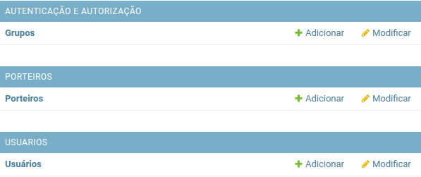
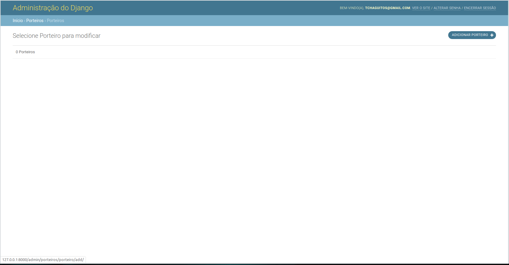
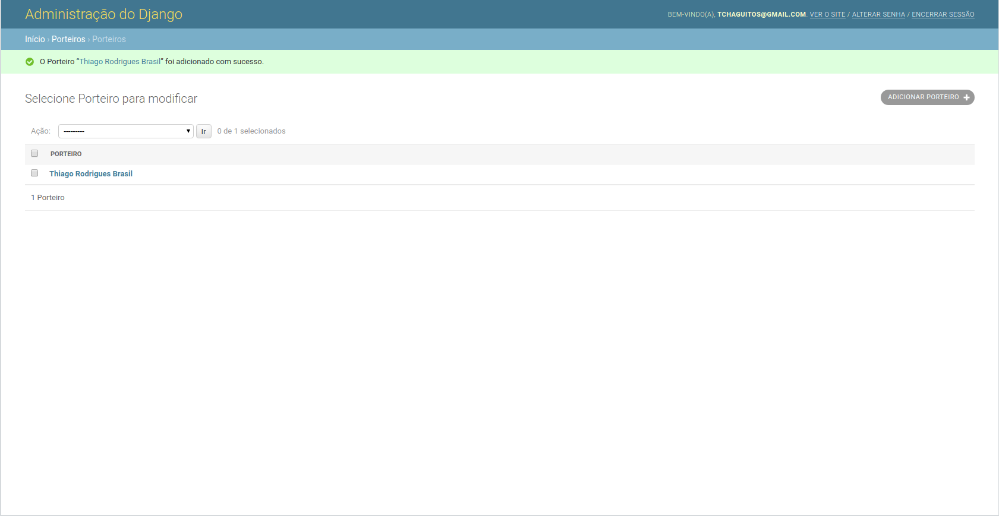

# Capítulo 03

## Criando aplicativo para gerenciar porteiros

Aprendemos como instalar nossas dependências, como iniciar um novo projeto e já até escrevemos um modelo personalizado de usuários. Com isso, podemos dizer que já temos uma base sólida para iniciar, de fato, a construção dos módulos que estão diretamente ligados aos requisitos que o sistema deverá atender.

A partir dos requisitos que temos, é possível identificar que existe a necessidade de que os porteiros do condomínio tenham acesso a uma página para registrar os visitantes. Com isso em mente, podemos concluir:

* Os porteiros terão um usuário para acessar o sistema
* Deverá existir um modelo para representar os porteiros do condomínio
* Os porteiros deverão ter acesso a uma dashboard com funcionalidades específicas
* Deverá existir uma página para um porteiro registrar um visitante no condomínio

Vamos nos concentrar em cada item separadamente e, por agora, vamos focar no desenvolvimento da classe modelo que vai representar nossos porteiros. 

Já falamos que os aplicativos de um projeto Django devem executar tarefas específicas, como gerenciar os usuários do sistema - que é exatamente o que o nosso aplicativo `usuarios` faz. Sendo assim, vamos iniciar um novo aplicativo com nome de "porteiros" que será responsável por gerenciar tudo referente aos porteiros. Vamos utilizar nosso bom e velho amigo `manage.py`:

```bash
(env)$ python manage.py startapp porteiros
```

Conforme vimos, será criado um diretório com o nome informado para representar o módulo do nosso aplicativo e, além disso, temos que instalar nosso novo aplicativo nas configurações do projeto. Vamos abrir nosso arquivo de configurações e inserir o aplicativo "porteiros" na variável `INSTALLED_APPS`:

```python
INSTALLED_APPS += [
    "usuarios",
    "porteiros",
]
```


Caso não se lembre, tudo bem... nosso arquivo de configurações é o `settings.py`.


Agora que criamos e registramos nosso aplicativo, vamos partir para a construção do modelo que vai representar os porteiros.

## Escrevendo as models do nosso aplicativo de porteiros

Assim como escrevemos a classe `Usuario` como subclasse de `models.Model` para representar e descrever nossos usuários, vamos escrever a classe `Porteiro` que será a representação de nossos porteiros. Em nosso documento de requisitos é possível verificar que os porteiros devem possuir os seguintes atributos:

* Usuário para acesso ao sistema \(e-mail\)
* Nome completo
* CPF
* Telefone
* Data de nascimento

O primeiro passo será criar a classe `Porteiro` no arquivo `porteiros/models.py`. Como já sabemos os atributos que um porteiro deve ter e já usamos o campo do tipo `CharField` anteriormente, começaremos trabalhando nos atributos que são deste tipo \(nome completo, CPF e telefone\):

```python
from django.db import models

class Porteiro(models.Model):

    nome_completo = models.CharField(
        verbose_name="Nome completo",
        max_length=194
    )

    cpf = models.CharField(
        verbose_name="CPF",
        max_length=11,
    )

    telefone = models.CharField(
        verbose_name="Telefone de contato",
        max_length=11,
    )
```

Nossos três primeiros campos receberão apenas os argumentos `verbose_name` e `max_length`. O primeiro para dizer por qual nome devemos chamar o campo e o segundo para dizer o tamanho máximo permitido.


Apesar de CPF e telefone serem representados por números, possuem características e particularidades que fazem com que a gente trabalhe com eles como se fossem texto. Além disso, o telefone está com tamanho 11 pois vamos trabalhar com o DDD + 9 dígitos.


### Conhecendo o campo DateField

Sabemos também que, por exigência do setor de RH, é necessário informar a data de nascimento do porteiro para realização do cadastro. Vamos adicionar mais um campo ao nosso modelo, agora com nome de `data_nascimento` e o tipo data \(`DateField`\).

Os campos do tipo data representam datas - obviamente, mas é interessante a gente prestar atenção ao fato de que esses campos são representados por instâncias do tipo `datetime.date` que é como as datas são tratadas no Python e podem receber dois argumentos que ainda não conhecemos: `auto_now` e `auto_now_add`.

O argumento `auto_now` diz para o Django que é necessário atualizar o valor sempre que nosso objeto for salvo. Se nós definirmos ele como `True` \(verdadeiro\), o valor de `data_nascimento` será atualizado para um valor atual sempre que atualizarmos as informações de um porteiro. No caso do argumento `auto_now_add`, ele diz para o Django que é necessário inserir a data atual como valor do atributo no momento da criação do registro no banco de dados e, feito isso, o valor não é atualizado novamente.

Como nosso objetivo é informar uma data que represente a data de nascimento do porteiro, vamos dizer ao Django que não é necessário preencher o campo automaticamente apenas setando os valores dos argumentos como `False`. 

```python
from django.db import models

class Porteiro(models.Model):

    nome_completo = models.CharField(
        verbose_name="Nome completo",
        max_length=194
    )

    cpf = models.CharField(
        verbose_name="CPF",
        max_length=11,
    )

    telefone = models.CharField(
        verbose_name="Telefone de contato",
        max_length=11,
    )
    
    data_nascimento = models.DateField(
        verbose_name="Data de nascimento",
        auto_now_add=False,
        auto_now=False
    )
```

### Conhecendo o campo OneToOneField

Até o momento utilizamos apenas campos do tipo texto e data, que são campos bastante úteis, mas que não são os ideais para todos os tipos de dados necessários para nosso modelo. Sendo assim, temos que conhecer um pouco mais dos tipos de campos disponíveis nos modelos do Django.

Sabemos que um dos requisitos é que haja um usuário do sistema para cada porteiro. Sendo assim, podemos dizer que é necessário vincular um usuário ao modelo que irá representar os porteiros em nosso sistema.

Uma vez que já temos o nosso modelo de usuários definido, temos que apenas vinculá-lo ao modelo de porteiros. Para tal, vamos conhecer o campo `OneToOne` que é quem vai tornar explícito esse vínculo entre os modelos. Essencialmente, o campo `OneToOne` representa uma relação "um para um". Isto é, para cada porteiro existirá um único usuário. 

Para utilizar esse tipo de campo é bem fácil e funciona de modo bem parecido com os outros que já conhecemos, mudando apenas o argumento obrigatório que deve ser passado para o campo funcionar corretamente. Acima do atributo `nome_completo`, vamos começar definindo o atributo `usuario` que será igual a `models.OneToOneField()`. 

```python
from django.db import models

class Porteiro(models.Model):

    usuario = models.OneToOneField()

    nome_completo = models.CharField(
        verbose_name="Nome completo",
        max_length=194
    )

    cpf = models.CharField(
        verbose_name="CPF",
        max_length=11,
    )

    telefone = models.CharField(
        verbose_name="Telefone de contato",
        max_length=11,
    )
    
    data_nascimento = models.DateField(
        verbose_name="Data de nascimento",
        auto_now_add=False,
        auto_now=False
    )
```

Conforme falamos, os argumentos que devem ser passados variam de campo para campo. Para o campo `OneToOne`, é necessário dizer qual modelo queremos que seja vinculado. Isto é, temos que dizer que o atributo `usuario` do modelo `Porteiro` deverá receber como valor uma instância da classe `Usuario`. Sempre que formos criar um `Porteiro` temos que criar também um `Usuario` e vinculá-lo ao `Porteiro` criado.

Vamos primeiro dizer qual é o modelo que queremos vincular ao atributo. Para o caso é o modelo `Usuario` do aplicativo `usuarios`. Podemos fazer isso passando apenas um texto contendo o caminho do modelo \(`usuarios.Usuario`\). Os outros dois argumentos são o `verbose_name`, que nós já conhecemos e o `on_delete`, que é um nome novo para nós. O `on_delete` diz para o Django o que deve ser feito com o registro do porteiro caso o usuário seja deletado. Nesse caso, se o usuario for removido da base de dados, o mesmo acontecerá com o porteiro.

```python
from django.db import models

class Porteiro(models.Model):

    usuario = models.OneToOneField(
        "usuarios.Usuario",
        verbose_name="Usuário",
        on_delete=models.CASCADE
    )
    
    # código abaixo omitido...
```

Para finalizar, vamos escrever as classes e métodos que devem acompanhar todos os modelos do Django. Vamos começar com a classe `Meta` e depois escrever o método `__str__`. Como vimos, devemos escrever essa classe e método para definir informações de como o modelo pode ser chamado, o nome da tabela que irá armazenar as informações no banco de dados e como a instância é exibida ao ser transformada em string. Nossa classe `Porteiro` ficará assim:

```python
from django.db import models

class Porteiro(models.Model):

    usuario = models.OneToOneField(
        "usuarios.Usuario",
        verbose_name="Usuário",
        on_delete=models.CASCADE
    )

    nome_completo = models.CharField(
        verbose_name="Nome completo", max_length=194
    )

    cpf = models.CharField(
        verbose_name="CPF",
        max_length=11,
    )

    telefone = models.CharField(
        verbose_name="Telefone de contato",
        max_length=11,
        blank=True
    )

    data_nascimento = models.DateField(
        verbose_name="Data de nascimento",
        auto_now=False
    )

    class Meta:
        verbose_name = "Porteiro"
        verbose_name_plural = "Porteiros"
        db_table = "porteiro"

    def __str__(self):
        return self.nome_completo
```

## Registrando nossa aplicação no Admin do Django

O próximo passo que vamos executar é tornar o nosso modelo de porteiros visível para o Admin do Django. Como já sabemos fazer isso, vai ser bem rápido!

Vamos abrir o arquivo `admin.py` do nosso aplicativo porteiros, importar a classe `Porteiro` e passá-la como argumento do método `admin.site.register()`.

```python
from django.contrib import admin
from porteiros.models import Porteiro

admin.site.register(Porteiro)
```

## Aplicando as alterações em nosso banco de dados

Feito isso, vamos agora validar o código escrito e criar as migrações do modelo criado utilizando o comando `makemigrations`.

```bash
(env)$ python manage.py makemigrations porteiros
```

Se ocorrer bem, vamos receber as seguintes informações em nosso terminal:

```text
Migrations for 'porteiros':
  porteiros/migrations/0001_initial.py
    - Create model Porteiro
```

Com todas as informações necessárias para executar as alterações no banco de dados armazenadas em forma de migração, vamos pedir ao Django que efetue essas alterações em nosso banco. Para isso vamos executar o comando `migrate`.

```bash
(env)$ python manage.py migrate
```

E, se tudo ocorrer bem, vamos receber em nosso terminal:

```text
Operations to perform:
  Apply all migrations: admin, auth, contenttypes, porteiros, sessions, usuarios

Running migrations:
  Applying porteiros.0001_initial.py... OK
```

## Criando porteiro através do Admin do Django

Como sabemos, o Django disponibiliza uma interface de administração para as classes de modelo criadas e registradas nos arquivos `admin.py`. Até agora, tudo que fizemos foi apenas visualizar e alterar informações de usuários, mas é possível fazer bem mais com o Admin do Django. Vamos acessar o admin através do navegador e clicar no item porteiros.



A próxima tela deverá exibir a lista de porteiros registrados em nosso sistema. Como ainda não temos porteiros registrados, temos apenas a informação de que existem "0 Porteiros" e opção de adicionar um porteiro. 



Vamos clicar no botão "adicionar porteiro" para ter acesso ao formulário de cadastro de porteiros. Para adicionar um porteiro, basta preencher as informações obrigatórias que são usuário, nome completo, CPF e data de nascimento. Note que os campos obrigatórios ficam destacados em negrito.


O Admin do Django é tão interessante que já disponibiliza um elemento do tipo select para selecionarmos o usuário que será vinculado ao novo porteiro. Bacana, não?


Vamos selecionar o usuário criado através do terminal com o comando `createsuperuser` e preencher as informações necessárias. Esteja livre para preencher da sua maneira!


Você deve utilizar o formato DD/MM/AAAA para a data de nascimento do porteiro


Se tudo estiver certo com os dados informados, o Django Admin vai nos redirecionar para a tela que lista os porteiros e mostrar uma mensagem de sucesso. Note que o Django já exibe a mensagem personalizada com o nome do porteiro criado e link para visualização das informações.



Agora que temos um porteiro criado, podemos partir para a construção da dashboard que contará com as funções descritas em nosso documento de requisitos.

