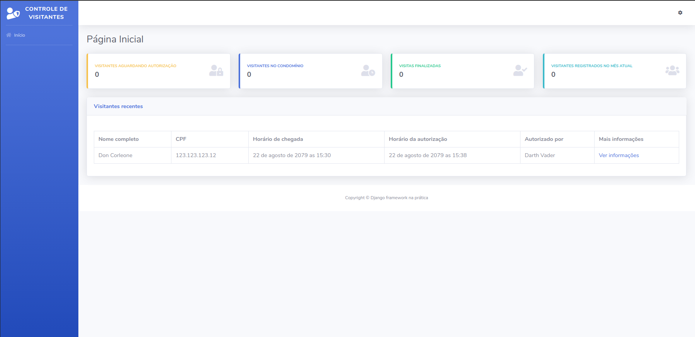

# Capítulo 04

## Configurando a aplicação para trabalhar com arquivos estáticos e templates HTML

Nos capítulos anteriores, iniciamos o projeto e criamos toda a estrutura necessária para administração de usuários do sistema e porteiros que serão os responsáveis por operar a dashboard proposta. Além disso, também preparamos o ambiente de desenvolvimento e aprendemos bastante sobre detalhes técnicos do funcionamento do Django.

Focamos nosso trabalho nos arquivos `models.py` e `admin.py` e também conhecemos o poder existente do Admin que o Django nos disponibiliza. Como nosso objetivo é desenvolver uma dashboard personalizada para exibir as informações dos visitantes do condomínio e implementar funcionalidades específicas, a partir de agora, trabalharemos para desenvolver os templates que irão apresentar as informações necessárias e executar as funcionalidades que vamos desenvolver. Sendo assim, posso dizer que a partir de agora as coisas começam a ficar mais interessantes!

Neste próximo módulo, aprenderemos a configurar o Django para trabalhar com arquivos estáticos \(CSS e JS\) e templates HTML.


O Django, por padrão, vem configurado para que já seja possível trabalhar com templates HTML, mas vamos alterar as configurações para que a haja uma maior organização dos arquivos e de modo que a gente agrupe todos os template numa só pasta


### Criando a pasta templates em nosso projeto

Sendo um framework web, o Django precisa fornecer uma maneira de gerar os templates de forma dinâmica, de modo que seja possível exibir valores específicos e atender os diversos cenários. Essencialmente, um template é constituído por uma parte estática, que são os arquivos CSS e JS e partes que se repetem, e uma parte onde serão exibidas as informações desejadas, que variam de acordo com cada cenário.


Imagine em nosso caso em que os porteiros deverão registrar visitantes. Para cada visitante, teremos informações diferentes e, desta forma, o template deverá ser capaz de exibir essas informações de acordo com o contexto de cada visitante


Para resolver esse problema, o Django nos fornece uma _engine_ rica e poderosa capaz de executar funções condicionais, loops, exibir valores e ainda possui diversas funcionalidades que podem ser utilizadas diretamente nos templates HTML através de tags.


Uma engine de template nada mais é que uma aplicação que visa facilitar o processo de criação de templates HTML dinâmicos e tornar o processo de envio e exibição de informações nos templates menos burocrático


Por padrão, o Django vem configurado para procurar os templates dentro de cada aplicativo. Isto é, em cada aplicativo deverá existir uma pasta **templates** para armazenar os templates referentes ao aplicativo em questão. Todavia, para uma melhor organização, utilizaremos uma pasta externa para armazenar todos os arquivos de templates do projeto.

Para isso, começaremos alterando o arquivo `settings.py` do nosso projeto. Nesse arquivo é possível encontrar a variável `TEMPLATES`, que é responsável por definir as configurações de template do projeto, como _engine_ a ser utilizada, diretórios que armazenam os templates, dentre outras.

A variável `TEMPLATES` é uma lista que recebe um dicionário contendo valores específicos, tais como `BACKEND`, `DIRS`, `APP_DIRS` e `OPTIONS`, cada um com uma função específica. No nosso caso, vamos alterar o valor `DIRS` de uma lista vazia para uma lista contendo a string "templates", que é o nome da pasta que utilizaremos para armazenar os templates na raiz do projeto. A variável `TEMPLATES` ficará da seguinte forma:

```python
TEMPLATES = [
    {
        "BACKEND": "django.template.backends.django.DjangoTemplates",
        "DIRS": ["templates"],
        "APP_DIRS": True,
        "OPTIONS": {
            "context_processors": [
                "django.template.context_processors.debug",
                "django.template.context_processors.request",
                "django.contrib.auth.context_processors.auth",
                "django.contrib.messages.context_processors.messages",
            ],
        },
    },
]
```

Para facilitar as coisas e economizar um pouquinho de tempo, você pode fazer download da pasta **templates** zipada, extrair os arquivos e colocá-la na raíz do seu projeto:



### Criando a pasta static em nosso projeto

Feito isso, vamos agora definir as configurações para os arquivos estáticos do nosso projeto. Assim como para os templates, o Django também nos dá toda a estrutura necessária para trabalharmos com arquivos estáticos.

Por "arquivos estáticos", entenda arquivos do tipo CSS, JS \(javascript\) e imagens que serão utilizadas em nossos templates, tais como logotipo, imagem padrão para avatar de usuários, dentre outras.

Para realizarmos a configuração, vamos novamente alterar o arquivo `settings.py.` Ao final do arquivo, você vai encontrar a variável `STATIC_URL` que é onde nossos arquivos estáticos devem ficar, ou seja, na pasta `static` na raiz do projeto:

```python
STATIC_URL = "/static/"
```

Abaixo da variável `STATIC_URL`, coloque também o seguinte trecho de código:

```python
STATICFILES_DIRS = [
    os.path.join(BASE_DIR, "static")
]
```

Desta forma estamos dizendo para o Django que os arquivos estáticos devem ser procurados na pasta **static** na raiz do projeto. Para facilitar e economizar tempo novamente, faça download da pasta zipada clicando no link abaixo \(agora da pasta **static**, claro\) e a coloque na raiz do projeto:



Faça o download e coloque a pasta **static** na raiz do projeto, juntamente com a pasta **templates**. Feito isso, já podemos utilizar templates HTML e arquivos estáticos em nosso projeto.

## Criando views que renderizam templates

O HTML \(Linguagem de Marcação de HiperTexto\) é o bloco de construção mais básico da pilha de tecnologias que compõem a web, mas é ela que dá significado e define a estrutura do conteúdo das páginas. Existem também tecnologias que descrevem aparência/apresentação \(CSS\) e funcionalidade/comportamento \(Javascript\) de uma página web \(inclusive já falamos um pouquinho delas por aqui quando falamos sobre arquivos estáticos\).

Basicamente, um arquivo de template é um arquivo de texto com extensão `.html`. Os navegadores interpretam esses arquivos de texto e cuidam de exibir exatamente da maneira que você enxerga pelo seu monitor. 

Bacana não? Além disso, o HTML ajuda a dizer para os motores de busca o que é relevante, o que é texto, o que é imagem e tudo mais. Sendo assim, o HTML tem um papel fundamental dentro da web! 


E ah, não se assuste com a palavra **HiperTexto** no nome, hipertexto são apenas os links entre as páginas que se conectam na web. 


Como o Django já nos dá tudo que é necessário para criarmos aplicações web, ele também nos dá a possibilidade de criarmos views que renderizam templates. Isso significa que a partir de agora, ao invés de ser exibido um texto ao acessarmos uma URL através do navegador, como fizemos anteriormente, vamos dizer para o Django que é necessário exibir um template HTML, afim de exibir as informações de forma estruturada e de modo que fiquei fácil a compreensão para nossos usuários.

### Conhecendo a função render

Para que o Django exiba um template ao invés de um texto em tela, precisaremos alterar o retorno da nossa view chamada `index`. Antes de seguir, vamos trabalhar um pouco a memória e lembrar como a nossa view está:

```python
from django.http import HttpResponse

def index(request):
    return HttpResponse("Olá, mundo!")
```

Até então, utilizamos o `HttpResponse` para retornar uma mensagem, mas a partir de agora utilizaremos a função `render` para exibir um template HTML no lugar dessa mensagem. 

A função `render` é uma função de atalho do Django que nos possibilita combinar um template HTML e um dicionário de contexto. A função deve receber sempre a variável `request` e uma `string` representando o caminho do template a ser utilizado. Esses argumentos são obrigatórios e devem ser passados para a função `render` sempre que a mesma for utilizada.

Vamos alterar a nova view para que retorne a função `render` ao invés da classe `HttpResponse` passando a variável `request` e o caminho para o template `index.html`:

```python
def index(request):
    return render(request, "index.html")
```

Como já fizemos o download das pastas **static** e **templates** e toda a configuração necessária para funcionamento de ambas, o Django já reconhece a pasta e busca pelo template `index.html` dentro dela.

## Entendendo as adaptações necessárias no template

Como você deve ter percebido, o template não está sendo exibido como deveria. Isso porque os arquivos estáticos não foram carregados. Lembra que fizemos a configuração da variável `STATIC_URL`? Pois bem, precisamos falar dela aqui pois para que os arquivos sejam carregados corretamente, o caminho relativo até eles deve estar correto e é aqui que a `STATIC_URL` entra em cena.

### Conhecendo a tag static

Quando falamos anteriormente sobre a engine de templates do Django, falamos que ela é capaz de executar funções condicionais, loops, exibir valores e possui diversas outras funcionalidades que podem ser executadas diretamente nos templates através de tags. Vamos agora conhecer a primeira tag que vamos utilizar em nosso projeto, a tag **static**.

A tag static é a representação da variável `STATIC_URL` nos templates. O Django fornece essa tag no intuito de facilitar o trabalho com arquivos estáticos. Vamos aprender como utilizar a tag e resolver o problema de exibição do template.

O primeiro passo para utilizarmos a tag static é carregá-la no template. Para isso vamos inserir o seguinte trecho de código no topo do nosso HTML:

```markup
<!DOCTYPE html>



<html lang="pt-br">
```


Tags no Django são escritas dessa maneira: ``. Guarde isso, pois utilizaremos bastante no decorrer do curso. 


Com isso já podemos utilizar a tag no template `index.html`.

### Alterando o caminho dos arquivos estáticos

Como falamos, a tag `` é a representação da pasta **static.** A tag nos dá um link para essa pasta para utilização no carregamento dos arquivos estáticos nos templates. Como é o Django que cuida de toda essa parte por nós, também vamos delegar a ele o carregamento dos nossos arquivos JS, CSS e imagens.

#### Alterando as importações dos arquivos CSS

Vamos alterar primeiro as importações dos arquivos CSS. As linhas que fazem o carregamento dos arquivos CSS no template são:

```markup
<link href="css/sb-admin-2.min.css" rel="stylesheet">
<link href="vendor/fontawesome-free/css/all.min.css" rel="stylesheet" type="text/css">
```

Vamos alterar os textos referentes a `href` para utilizarmos a tag ``. As importações ficarão assim:

```markup
<link href="" rel="stylesheet">    
<link href="" rel="stylesheet" type="text/css">
```

#### Alterando as importações dos arquivos JS

Para alterarmos as importações dos arquivos JS, vamos encontrar as linhas:

```markup
<script src="vendor/jquery/jquery.min.js"></script>
<script src="vendor/bootstrap/js/bootstrap.bundle.min.js"></script>
<script src="js/sb-admin-2.min.js"></script>
```

E alterá-las para que fiquem da seguinte forma:

```markup
<script src=""></script>
<script src=""></script>
<script src=""></script>
```

Com isso, ao acessarmos [`http://127.0.0.1:8000/`](http://127.0.0.1:8000/) novamente no navegador, teremos o template exibido de forma estruturada com os arquivos CSS \(exibição\) e JS \(comportamento\) devidamente carregados. Nosso template será exibido desta forma no navegador:



## Exibindo variáveis no template

Quando conhecemos a função `render` falamos que ela é responsável por combinar um template HTML e um dicionário de contexto, mas não fomos a fundo a respeito do que é um dicionário de contexto.

Um dicionário de contexto é a variável do tipo dicionário que pode ser passada como argumento para a função `render`. Quando passada, é possível acessarmos os valores contidos na variável diretamente no template através de tags específicas, diferentes das tags utilizadas anteriormente.


Dicionário é uma estrutura de dados em Python de elementos \(ou propriedades\) não ordenados e que podemos acessar utilizando chaves. Os dicionários são estruturas poderosas e muito utilizadas. Existem linguagens que este tipo é conhecido como "matrizes associativas" ou apenas "objetos"


### Definindo nosso dicionário de contexto

Para fazer isso, vamos no arquivo `views.py` e vamos criar a variável `context` acima do retorno da função. A função `index` ficará da seguinte forma:

```python
def index(request):
    
    context = {
        "nome_pagina": "Início da dashboard",
    }
    
    return render(request, "index.html", context)
```

No código acima criamos a variável `context` já com o valor de `nome_pagina` definido como "Início da dashboard". Se a gente quisesse utilizar uma variável ao invés de um texto diretamente, poderíamos fazer desta forma: 

```python
def index(request):
    nome_pagina = "Início da dashboard"

    context = {
        "nome_pagina": nome_pagina,
    }
    
    return render(request, "index.html", context)
```

### Exibindo as informações nos templates

A partir de agora, vamos aprender um pouco mais sobre a linguagem de templates do Django. Ela foi projetada para ser poderosa e fácil de forma que seja confortável trabalhar com a linguagem HTML.

Essencialmente, templates são arquivos de texto, geralmente no formato HTML. Para o Django, um template pode conter variáveis que devem ser substituídas por valores quando o template for interpretado.

Agora que já definimos o nosso dicionário de contexto e passamos ele como argumento para a função `render`, vamos exibir essas informações no template `index.html`.

Para exibirmos os valores contidos no dicionário `context` basta utilizarmos a sintaxe para variáveis da linguagem de templates do Django: `{{ propriedade_do_dicionario }}`. Para nosso caso, vamos exibir o valor da propriedade `nome_pagina` que, dentro do dicionário `context`, corresponde ao texto **Início da dashboard**. 

Vamos abrir o arquivo `index.html` e procurar pela seguinte linha:

```markup
<h1 class="h3 mb-0 text-gray-800">Página inicial</h1>
```

Vamos alterar o texto da tag `h1` \(o texto **Página inicial**\) para exibir também o valor da nossa variável `nome_pagina` passada na variável `context` da view. A linha deverá ficar assim:

```markup
<h1 class="h3 mb-0 text-gray-800">{{ nome_pagina }}</h1>
```

Volte para o navegador, atualize a página e veja a mágica acontecer: o valor `{{ nome_pagina }}` será substituído pelo texto "Início da dashboard" que definimos no dicionário `context`. Se alterarmos o valor no arquivo `views.py` o mesmo acontece no `index.html`.

