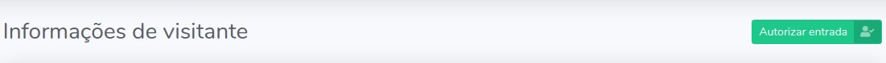
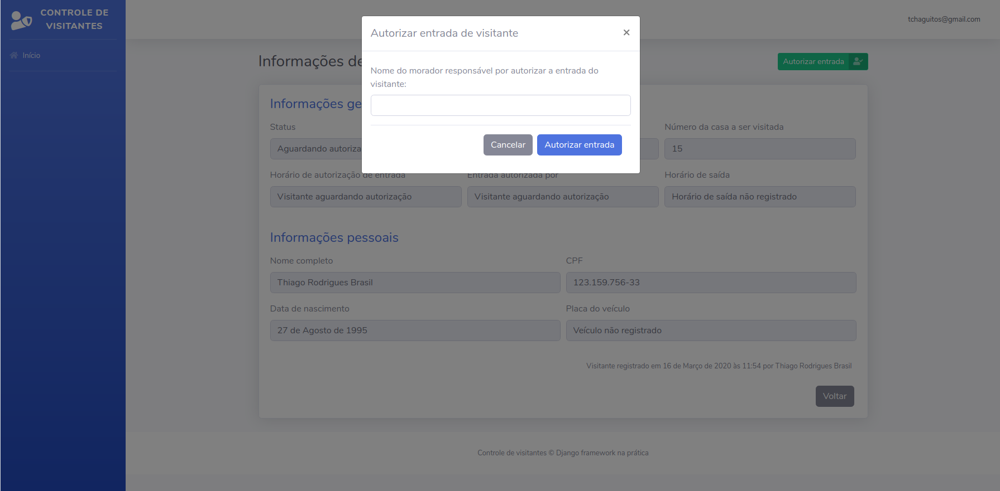

# Capítulo 09

## Criando funcionalidade para autorização de entrada de visitante

Nos capítulos anteriores, nos dedicamos à criação das funcionalidades para registro e visualização de informações de visitantes. Aprendemos um pouco sobre como requisições funcionam, aprendemos a utilizar os formulários do Django, adaptamos os templates e aprendemos um pouco mais como eles funcionam, conhecemos o `django-widget-tweaks`, o Django `messages` e o `get_object_or_404` e ainda criamos métodos personalizados para nosso modelo de visitantes. Olha só quanta coisa conseguimos absorver somente nesses últimos capítulos!

Com essas funcionalidades criadas, precisamos seguir o roteiro que criamos com base nas necessidades do cliente, de modo que, agora, trabalharemos na funcionalidade que autoriza a entrada do visitante no condomínio. Quando um visitante chega na portaria e se identifica, o mesmo deve aguardar que o colaborador responsável, no caso o porteiro, entre em contato com um morador da casa a ser visitada e autorize que este visitante adentre ao condomínio.

Ao receber a informação de que o visitante pode adentrar ao condomínio, o porteiro deverá registrar na dashboard qual o nome do morador que autorizou a entrada deste visitante. Para fins de controle, também é necessário que o sistema registre o horário em que essa autorização ocorreu. Sendo assim, no momento da autorização do visitante, devemos registrar o horário e o nome do morador responsável pela autorização.

## Criando um status diferente para cada estágio da visita

Antes de seguir em frente, precisamos analisar o cenário e extrair algumas informações com base nos fluxos e eventos que ocorrem em uma visita. Existem três cenários para o visitante: quando ele chega na portaria e está aguardando autorização \(status 1\), quando ele está dentro do condomínio realizando a visita \(status 2\) e quando ele vai embora e finaliza a visita \(status 3\).

Definir e tornar esses status explícitos é interessante pois assim podemos diferenciar os estágios em que cada visitante se encontra e ainda contabilizar visitantes estão aguardando autorização, em visita dentro do condomínio e quantos já foram embora. Assim temos mais clareza com relação às informações e ainda conseguimos contabilizar esses números para exibir na página inicial da nossa dashboard.

Vamos voltar ao nosso arquivo `models.py` do aplicativos **visitantes** e adicionar o atributo `status` ao modelo de Visitante. Ele será do tipo `CharField`, mas com a diferença que receberá uma lista pré determinada de opções disponíveis para escolha. Essa lista deverá guardar as opções disponíveis e devemos definir sempre o valor que será salvo em nosso banco de dados e o valor que será exibido para o usuário final. Antes de criar o atributo, vamos criar a variável `STATUS_VISITANTE`, que ficará da seguinte forma:

```python
class Visitante(models.Model):

    STATUS_VISITANTE = [
        ("AGUARDANDO", "Aguardando autorização"),
        ("EM_VISITA", "Em visita"),
        ("FINALIZADO", "Visita finalizada"),
    ]
    
    # código abaixo omitido
```


A lista `STATUS_VISITANTE` segue o que foi dito anteriormente e define os status `Aguardando autorização`, `Em visita` e `Finalizado`. O primeiro valor, em letras maiúsculas, será guardado no banco de dados e o segundo é o texto que será exibido para o usuário final. Sendo assim, quando o visitante receber o status `AGUARDANDO`, o texto **Aguardando autorização** será exibido.


Com isso, agora vamos adicionar o atributo `status` ao nosso modelo. Além dos argumentos `verbose_name` e `max_length` que já conhecemos, também vamos passar os argumentos `choices` e `default`. O primeiro é a lista que criamos com as opções disponíveis para escolha e o segundo é o valor padrão a ser definido quando uma instância do modelo for criada. Nosso código ficará assim:

```python
class Visitante(models.Model):

    STATUS_VISITANTE = [
        ("AGUARDANDO", "Aguardando autorização"),
        ("EM_VISITA", "Em visita"),
        ("FINALIZADO", "Visita finalizada"),
    ]
    
    status = models.CharField(
        verbose_name="Status",
        max_length=10,
        choices=STATUS_VISITANTE,
        default="AGUARDANDO",
    )
    
    # código abaixo omitido
```


O status `default` será `AGUARDANDO` pois sempre que um visitante chega à portaria, fica aguardando a autorização de um morador


### Criando o arquivo de migrações

Como vimos anteriormente, sempre que mudamos a estrutura do nosso modelo, precisamos criar um arquivo que registra essas alterações em formato de migração para que seja possível efetuar as alterações no banco de dados posteriormente. Mais uma vez, utilizaremos o comando `makemigrations`:

```python
(env)$ python manage.py makemigrations visitantes
```

O terminal deverá mostrar algo parecido com isto:

```python
Migrations for 'visitantes':
  visitantes/migrations/0005_visitante_status.py
    - Add field status to visitante
```

### Efetuando as alterações no banco de dados

Nada diferente do que já vimos, vamos agora utiliza o comando `migrate` para efetuar as mudanças em nosso banco de dados:

```python
(env)$ python manage.py migrate
```

## Criando formulário para atualizar atributos específicos do visitante

Sabemos que precisamos registrar o nome do morador responsável por autorizar a entrada do visitante, além de salvar data e hora e, agora que temos um status, alterar esse status. Por padrão e uma questão lógica, como falamos no tópico anterior, sempre que criamos um visitante o mesmo recebe o status `AGUARDANDO` e, quando sua entrada for autorizada, vamos alterar esse status para `EM_VISITA`.

Criaremos a funcionalidade na tela que exibe as informações do visitante, de forma que, quando o visitante estiver aguardando autorização, vamos exibir um botão para executar a funcionalidade que autorizará sua entrada. Utilizaremos um formulário para receber o nome do morador responsável e as informações referentes ao horário de autorização e status serão definidas diretamente na view.

Para começar, vamos abrir o arquivo `forms.py` do aplicativos **visitantes** e criar o formulário `AutorizaVisitanteForm`, uma subclasse de `ModelForm` bem parecida com a que já criamos, com a diferença que terá apenas o campo `morador_responsavel` na lista `fields`:

```python
class AutorizaVisitanteForm(forms.ModelForm):
    morador_responsavel = forms.CharField(required=True)

    class Meta:
        model = Visitante
        fields = [
            "morador_responsavel",
        ]
        error_messages = {
            "morador_responsavel": {
                "required": "Por favor, informe o nome do morador responsável por autorizar a entrada do visitante"
            }
        }
```

Ao criamos um formulário, podemos também sobrescrever os campos definidos automaticamente por causa da classe modelo, caso a gente queira complementar alguma informação ou personalizar algum comportamento. No nosso caso, como o atributo `morador_responsavel` não é obrigatório no modelo, também não será no formulário, mesmo que a gente esteja recebendo apenas ele. Por isso vamos sobrescrever o campo no formulário, afim de explicitar que ele deve ser obrigatório. Além disso, também vamos definir uma mensagem de erro para caso o campo não seja preenchido. Feito isso, já podemos utilizar o formulário em nossa view.

## Alterando view para autorizar entrada de visitante

Agora que criamos um formulário para receber o nome do morador responsável, temos que realizar algumas alterações em nossa view e em nosso template para que o formulário seja exibido e funcione corretamente.

Já escrevemos um código bem parecido com o que vamos escrever agora, o da view `registrar_visitante`. Desta vez, vamos importar o formulário `AutorizaVisitanteForm` no arquivo `views.py` do aplicativo **visitantes**. O trecho onde as importações são feitas ficará assim:

```python
from django.contrib import messages
from django.shortcuts import (
    render, redirect, get_object_or_404
)

from visitantes.models import Visitante
from visitantes.forms import (
    VisitanteForm, AutorizaVisitanteForm
)

# código abaixo omitido
```

Com o formulário importado no arquivo `views.py`, vamos trabalhar na função `informacoes_visitante()`, exatamente da forma que fizemos na função `registrar_visitante()`: criar a variável form, verificar se o método POST está sendo utilizado na requisição, passar o corpo da requisição para o formulário, verificar se as informações são válidas, salvar o formulário, exibir a mensagem de sucesso e redirecionar o usuário. Não podemos nos esquecer, claro, de passar o formulário no contexto da view. A função ficará assim:

```python
def informacoes_visitante(request, id):
    
    visitante = get_object_or_404(Visitante, id=id)
    
    form = AutorizaVisitanteForm()
    
    if request.method == "POST":
        form = AutorizaVisitanteForm(
            request.POST, instance=visitante
        )
        
        if form.is_valid():
            form.save()

            messages.success(
                request,
                "Entrada de visitante autorizada com sucesso"
            )

            return redirect("index")
    
    context = {
        "nome_pagina": "Informações de visitante",
        "visitante": visitante,
        "form": form,
    }
    
    return render(request, "informacoes_visitante.html", context)
```

Note que, desta vez, passamos também o argumento `instance` para o nosso formulário. Quando fazemos isso, o Django entende que queremos atualizar o objeto em questão \(o visitante com `id` igual à passada para a função, no caso\). Estamos dizendo para o Django atualizar o visitante em questão utilizando a informação do corpo da requisição.

## Alterando template para exibir modal com formulário

Como passamos a variável `form` no contexto, podemos agora alterar nosso template para que exiba esse formulário. Como as informações do visitante já ocupam grande parte do template, utilizaremos um elemento HTML conhecido como modal para exibir o formulário. Na verdade, ele é feito unindo as tecnologias HTML, CSS e Javascript e é um elemento que se sobrepõe aos outros, quase como um pop-up \(aquelas janelas chatas que piscam na tela\).

Antes de tudo, vamos adicionar o botão que será responsável por exibir o modal com o formulário. Abra o arquivo `informacoes_visitante.html` e abaixo do elemento `<h1 class="h3 mb-0 text-gray-800">` insira o seguinte trecho de código:

```markup
<!-- código acima omitido -->
<h1 class="h3 mb-0 text-gray-800">{{ nome_pagina }}</h1>

<!-- trecho de código a ser inserido -->
<div>
    <a href="#" class="btn btn-success btn-icon-split btn-sm" data-toggle="modal" data-target="#modal1">
        <span class="text">Autorizar entrada</span>
                    
        <span class="icon text-white-50">
            <i class="fas fa-user-check"></i>
        </span>
    </a>
</div>
<!-- código abaixo omitido -->
```

O que estamos fazendo é adicionar um elemento `<div>` ao lado do título da página que possui um link \(elemento `<a>`\) para um elemento modal chamado de `#modal1`, que ainda vamos inserir na página. O template ficará parecido com isso:



Feito isso, adicione também o código HTML do modal antes do fechamento da tag do elemento `<div class="container">`:

```markup
<div class="modal fade" id="modal1" tabindex="-1" role="dialog" aria-labelledby="exampleModalLabel" aria-hidden="true">
    <div class="modal-dialog" role="document">
        <div class="modal-content">
            <div class="modal-header">
                <h5 class="modal-title" id="exampleModalLabel">Autorizar entrada de visitante</h5>
                
                <button type="button" class="close" data-dismiss="modal" aria-label="Close">
                    <span aria-hidden="true">&times;</span>
                </button>
            </div>
            
            <div class="modal-body">
                <form method="post">
                    

                    <div class="form-group">
                        <label for="id_morador_responsavel" class="col-form-label">Nome do morador responsável por autorizar a entrada do visitante:</label>
                        
                    </div>
                        
                    <div class="modal-footer">
                        <button type="button" class="btn btn-secondary" data-dismiss="modal">Cancelar</button>
                        <button type="submit" class="btn btn-primary">Autorizar entrada</button>
                    </div>
                </form>
            </div>
        </div>
    </div>
</div>
```

Conforme falado, esse modal deve exibir nosso formulário de cadastro de morador responsável, e é isso que estamos fazendo. Criamos a estrutura HTML para o formulário dentro do elemento `<div class="modal-body">` de forma bem parecida com que foi feito anteriormente para renderizar o campo, com a diferença que agora estamos acessando o campo `morador_responsavel` do formulário diretamente para passá-lo para a tag ``.

Já utilizamos a tag `` anteriormente, quando renderizamos nosso formulário para registro de novos visitantes. A dinâmica utilizada aqui será a mesma, com a diferença que vamos acessar o campo do formulário diretamente \(`form.morador_responsavel`\).


Note que o template baixado no capítulo anterior já possui a tag de importação do django-widget-tweaks \(``\).


Feito isso, vamos agora visualizar as informações de um visitante qualquer e tentar autorizar sua entrada por meio do formulário que criado. Note que, quando clicamos no botão, o modal com o formulário aparece na tela:



## Atualizando os campos horario\_autorizacao e status diretamente

Ao testar o formulário e constatar que tudo ocorreu bem, você deve ter notado que, apesar do nome do morador responsável ter sido atualizado, os valores de `horario_autorizacao` e `status` continuaram os mesmos. Isso porque nosso formulário está atualizando apenas o campo `morador_responsavel`, e era isso que estávamos esperando, visto que colocamos apenas este campo na propriedade `fields` do formulário em questão. Mas como vamos atualizar estes outros campos?

### Atualizando o status

Quando criamos o formulário para registro de visitantes, definimos o valor do atributo `registrado_por` diretamente e é o que faremos neste caso também. Para isso, vamos alterar a view para que seja possível setar esses valores diretamente.

```python
# código acima omitido

if form.is_valid():
    visitante = form.save(commit=False)
    
    visitante.status = "EM_VISITA"

    visitante.save()

    messages.success(
        request,
        "Entrada de visitante autorizada com sucesso"
    )

    return redirect("index")

# código abaixo omitido
```

Dessa forma, já estamos definindo o valor que o status receberá caso o formulário seja válido e salvando o novo visitante, mas ainda precisamos registrar o horário em que essa autorização ocorreu, ou seja, o horário em que o formulário atualizou o atributo `morador_responsavel` e alterou o status para `EM_VISITA`.

### Conhecendo o datetime do Python

O Python, por padrão, possui um módulo para trabalhar com datas e horas que é o `datetime`. Esse módulo nos fornece inúmeras ferramentas para trabalharmos com esses tipos de forma bem facilitada. O primeiro passo é importarmos o módulo na view.

```python
from django.contrib import messages
from django.shortcuts import (
    render, redirect, get_object_or_404
)

from visitantes.models import Visitante
from visitantes.forms import (
    VisitanteForm, AutorizaVisitanteForm
)

from datetime import datetime

# código abaixo omitido
```

O `datetime` possui um método chamado `now()` que nos retorna data e hora do momento em que a chamada ao método ocorreu. Sendo assim, caso o registro do visitante ocorra no dia `21 de agosto de 2020 às 15:00`, o método `datetime.now()` retornará exatamente essa data. Dessa forma, tudo que precisamos fazer é igualar o atributo `horario_autorizacao` à chamada do método `datetime.now()`. Nossa view ficará assim:

```python
# código acima omitido

if form.is_valid():
    visitante = form.save(commit=False)
    
    visitante.status = "EM_VISITA"
    visitante.horario_autorizacao = datetime.now()

    visitante.save()

    messages.success(
        request,
        "Entrada de visitante autorizada com sucesso"
    )

    return redirect("index")

# código abaixo omitido
```

Dessa forma, atualizamos o nome do morador responsável através do formulário e, caso a informação seja válida, atualizamos os atributos `status` e `horario_autorizacao` diretamente.

