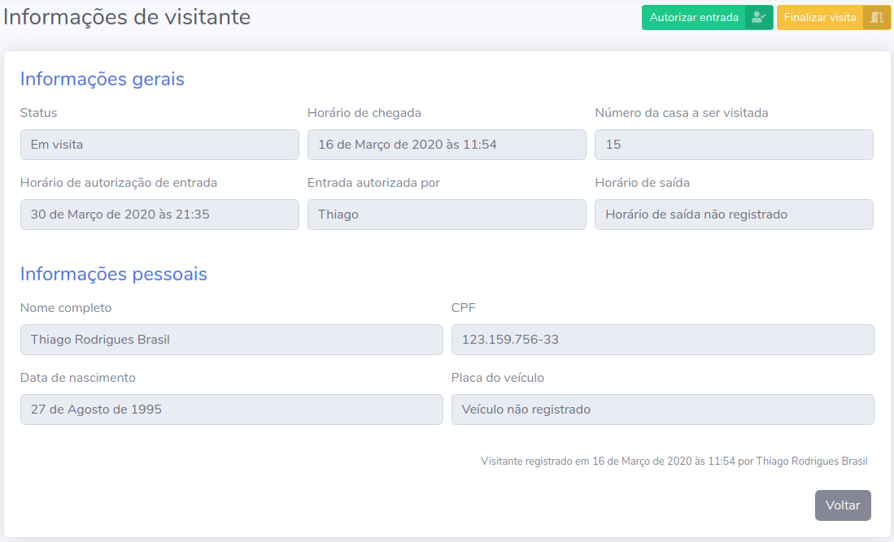
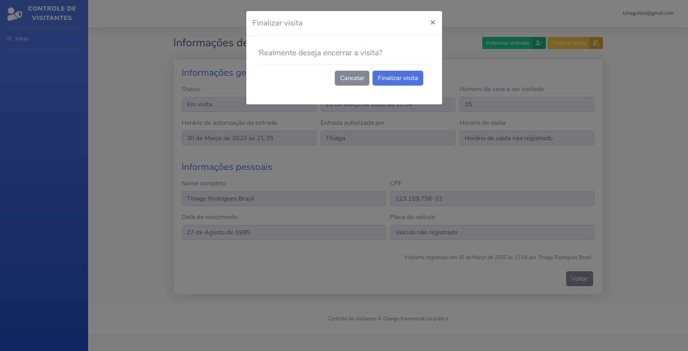

# Capítulo 10 - dev

## Criando função para finalizar visita

Agora que criamos a função para autorizar a entrada do visitante, precisamos também criar a função que finaliza a visita. Para a primeira, utilizamos o formulário `AutorizaVisitanteForm` para atualizar o nome do morador responsável e definimos manualmente o status e o horário de autorização.

Desta vez, precisamos atualizar apenas o valor do atributo `horario_saida` e alterar o status para `FINALIZADO`, que é o status para quando o visitante deixa o condomínio. Sendo assim, vamos criar uma outra view que será responsável por receber um `id`, buscar um visitante com este `id` e atualizar essas informações. A view será um pouco parecida com a view `informacoes_visitante`. 

Abaixo da função `informacoes_visitante` crie e função `finalizar_visita`:

```python
# código acima omitido

def finalizar_visita(request, id):

    if request.method == "POST":
        visitante = get_object_or_404(Visitante, id=id)

        visitante.status = "FINALIZADO"
        visitante.horario_saida = datetime.now()

        visitante.save()

        messages.success(
            request,
            "Visita finalizada com sucesso"
        )

        return redirect("index")
```

A função `finalizar_visita` deverá receber um `id` como argumento e utilizar a função `get_object_or_404` para buscar o visitante do `id` que foi passado. Após isso vamos atualizar os atributos `status` e `horario_saida` diretamente e salvar o visitante. A diferença aqui é que não utilizaremos um formulário e nossa view será acessada somente através do método `POST`. Todo o resto continuará bem parecido com as funções que já desenvolvemos.

Para garantir que as operações serão realizadas somente quando o método `POST` for utilizado, vamos escrever um `if` para certificar essa informação \(`if request.method == "POST":`\) e, caso seja, vamos executar as operações necessárias. Note que, mais uma vez, estamos utilizando o método `datetime.now()` mas, desta vez, para o atributo `horario_saida`, e setando diretamente o `status` que agora deve receber o status `FINALIZADO`. 

Ao contrário das outras funções que escrevemos, a função `finalizar_visita` não poderá ser acessada através do método `GET`. O método `GET` é utilizado por uma requisição sempre que precisamos buscar informações em um servidor, como é o caso nas outras funções \(estamos buscando o template e todo o contexto relacionado a ele antes de enviar informações para o servidor\). Se você notar as funções `registrar_visitante` e `informacoes_visitante`, vai perceber que definimos algumas variáveis fora da instrução `if` que verifica se o método utilizado é o `POST`. Isso porque precisamos dessas variáveis quando o usuário acessa a página, como é o caso do formulário que deverá ser exibido mesmo que a requisição não seja enviada.

Para garantir que nossa view possa ser acessada somente pelo método `POST`, vamos utilizar a classe `HttpResponseNotAllowed` para nos ajudar. Ela é quem vai cuidar de toda parte de bloquear o acesso via método `GET` e retornar uma mensagem para o usuário quando isso ocorrer. Antes de tudo, precisamos importá-la em nosso arquivo `views.py` do aplicativo visitantes:

```python
from django.contrib import messages
from django.shortcuts import (
    render, redirect, get_object_or_404
)

from django.http import HttpResponseNotAllowed

from visitantes.models import Visitante
from visitantes.forms import (
    VisitanteForm, AutorizaVisitanteForm
)

from datetime import datetime

# código abaixo omitido
```

Feito isso, tudo que precisamos fazer é utilizar a instrução `else` e retornar a classe `HttpResponseNotAllowed` passando uma lista com os métodos permitidos e uma mensagem a ser exibida caso o método utilizado pela requisição seja diferente. Nosso código ficará assim:

```python
def finalizar_visita(request, id):

    if request.method == "POST":
        visitante = get_object_or_404(Visitante, id=id)

        visitante.status = "FINALIZADO"
        visitante.horario_saida = datetime.now()

        visitante.save()

        messages.success(
            request,
            "Visita finalizada com sucesso"
        )

        return redirect("index")

    else:
        return HttpResponseNotAllowed(
            ["POST"],
            "Método não permitido"
        )
```

Com isso, permitimos que a view seja acessada somente pelo método `POST` e que, quando outro método for utilizado, a view retorne o código `HTTP 405` e exiba a mensagem "Método não permitido". Quando a gente mapear essa view com uma URL, vamos testar utilizando nosso navegador!

## Criando URL

Assim como todas as outras funções de view que escrevemos, essa também será mapeada por meio de uma URL para que a gente possa acessá-la pelo navegador. Vamos lá para o nosso arquivos `urls.py` e criar essa nova URL. 

A URL que irá mapear a função `finalizar_visita` será bem parecida com a URL `informacoes_visitante`, mas a diferença que adicionaremos, após o `id`, a parte `finalizar-visita/`. Com isso, conseguimos diferenciar qual view chamar para quando o usuário desejar apenas visualizar as informações de um visitante e para quando desejar finalizar uma visita. Nosso arquivo `urls.py` ficará assim:

```python
from django.contrib import admin
from django.urls import path

import usuarios.views
import visitantes.views

urlpatterns = [
    path("admin/", admin.site.urls),

    path(
        "",
        usuarios.views.index,
        name="index",
    ),

    path(
        "registrar-vistante/",
        visitantes.views.registrar_visitante,
        name="registrar_visitante",
    ),

    path(
        "visitantes/<int:id>/",
        visitantes.views.informacoes_visitante,
        name="informacoes_visitante",
    ),

    path(
        "visitantes/<int:id>/finalizar-visita/",
        visitantes.views.finalizar_visita,
        name="finalizar_visita"
    )
]
```

Com isso, agora vamos verificar se a aplicação está realmente bloqueando requisições de métodos diferentes de `POST` para essa URL. Vamos abrir o endereço [http://127.0.0.1:8000/visitantes/1/finalizar-visita/](http://127.0.0.1:8000/visitantes/1/finalizar-visita/) em nosso navegador e verificar o que é retornado. 

Se o navegador exibir a mensagem "Método não permitido" é sinal que funcionou!

## Alterando template para exibir botão e modal para finalizar visita

Agora que temos a URL para onde devemos enviar uma requisição do tipo POST para sinalizar que queremos finalizar uma visita, vamos alterar as partes do template que vão possibilitar a interação do porteiro com essa funcionalidade.

Assim como inserimos um botão para quando queremos autorizar a entrada de um visitante, vamos inserir um botão para quando quisermos finalizar a visita. Abra o template `informacoes_visitante.html` e insera o seguinte trecho de código abaixo do botão responsável por autorizar a entrada do visitante:

```markup
<a href="#" class="btn btn-warning btn-icon-split btn-sm" data-toggle="modal" data-target="#modal2">
    <span class="text">Finalizar visita</span>
                    
    <span class="icon text-white-50">
        <i class="fas fa-door-open"></i>
    </span>
</a>
```

O template ficará assim:



Note que a estrutura é bem parecida com a que utilizamos no outro botão, mas quando observamos o atributo `data-target` podemos notar que agora ele é igual a `#modal2`. Isso porque vamos também criar um outro modal para ser exibido quando o usuário clicar no botão para finalizar uma visita. A função desse modal é obter a confirmação se é isso mesmo que o usuário deseja fazer.

Ainda no mesmo arquivo mas agora ao final do arquivo, vamos colocar o seguinte trecho de código logo abaixo da estrutura HTML do primeiro modal:

```markup
<div class="modal fade" id="modal2" tabindex="-1" role="dialog" aria-labelledby="exampleModalLabel" aria-hidden="true">
    <div class="modal-dialog" role="document">
        <div class="modal-content">
            <div class="modal-header">
                <h5 class="modal-title" id="exampleModalLabel">Finalizar visita</h5>
                    
                <button type="button" class="close" data-dismiss="modal" aria-label="Close">
                    <span aria-hidden="true">&times;</span>
                </button>
            </div>
            
            <div class="modal-body">
                <div class="modal-body">
                    <h5 class="mb-3">
                        Realmente deseja encerrar a visita?
                    </h5>

                    <form method="post" action="">
                        

                        <input hidden>

                        <div class="modal-footer">
                            <button type="button" class="btn btn-secondary" data-dismiss="modal">Cancelar</button>
                            <button type="submit" class="btn btn-primary">Finalizar visita</button>
                        </div>
                    </form>
                </div>
            </div>
        </div>
    </div>
</div>
```

Nosso segundo modal deverá exibir a mensagem "Realmente deseja encerrar a visita?" e conter um formulário que enviará uma requisição do tipo `POST` para a URL que criamos anteiormente. Esse formulário precisa ter apenas o campo renderizado pela tag `` para que possamos enviar requisições. Nosso model será exibido da seguinte maneira:



O que muda tudo aqui é o atributo `action` do formulário HTML. Graças a ele podemos direcionar um formulário para uma URL diferente da que estamos, diferentemente de como fizemos com os outros formulários. Dessa forma, conseguimos enviar uma requisição do tipo `POST` para a URL `` com toda informação que precisamos para identificar qual o `id` do visitante a ser atualizado assim que o usuário clicar no botão "Finalizar visita" confirmando a ação.

Vai em frente e teste a nova funcionalidade implementada!

## Prevenindo erros e operações desnecessárias

No passo anterior, finalizamos a criação da funcionalidade que finaliza as visitas dentro da nossa dashboard inserindo um botão no template. continuar...


