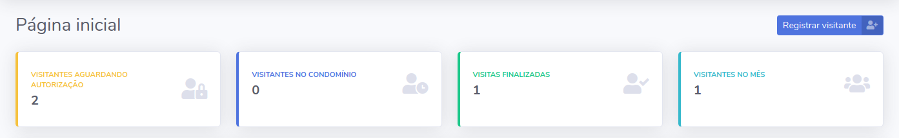

# Capítulo 12 - dev

## Criando aplicativos para administrar informações da dashboard

No capítulo anterior nós começamos a implementar algumas melhorias visando uma melhor experiência de utilização da nossa dashboard e ainda atuamos de forma a melhorar a estrutura do projeto para facilitar futuras manutenções. Seguindo nesse mesmo caminho, vamos criar um aplicativo chamado **dashboard** para administrar melhor as informações relacionadas principalmente à página inicial da dashboard. É importante também a gente lembrar que os aplicativos de um projeto Django devem dividir responsabilidades e cada um deles ter um único objetivo. 

Apesar da gente ter finalizado as principais funcionalidades da dashboard, ainda precisamos buscar alguns números para que sejam mostrados na página inicial. Se você observar o template, vai perceber que existem elementos que nos sugerem que devemos exibir o número de visitantes de cada status e quantos visitantes tivemos no mês atual. Queremos fazer algo desse tipo:



Todas essas informações podem ser tiradas a partir da queryset que busca todos os visitantes no banco de dados. Em breve vamos aprender como podemos fazer isso e tornar os dados na nossa dashboard dinâmicos.

Mas antes de tudo, vamos criar o aplicativo utilizando o `manage.py`:

```bash
(env)$ python manage.py startapp dashboard
```

E depois vamos adicionar o novo aplicativo ao arquivo de configurações, o `settings.py`:

```python
INSTALLED_APPS += [
    "usuarios",
    "porteiros",
    "visitantes",
    "dashboard",
]
```

## Migrando view "index" para aplicativo dashboard

Agora que nós temos um aplicativo para gerenciar as informações da nossa dashboard, vamos migrar a função de view `index` para o aplicativo **dashboard**. Para isso, vamos migrar o código do arquivo `usuarios/views.py` para `dashboard/views.py`. O arquivo `views.py` do aplicativo usuários \(`usuarios/views.py`\) ficará vazio e o arquivo `views.py` do aplicativo dashboard \(`dashboard/views.py`\) ficará assim:

```python
from django.shortcuts import render
from visitantes.models import Visitante

def index(request):
    
    visitantes = Visitante.objects.all()
    
    context = {
        "nome_pagina": "Página inicial",
        "visitantes": visitantes,
    }
    
    return render(request, "index.html", context)
```

Para finalizar a migração da nossa view, vamos também alterar o arquivo `urls.py`. Ao invés de `usuarios.views` vamos importar `dashboard.views` e fazer essa alteração também na `path()` que cria a URL. O arquivo ficará assim:

```python
from django.contrib import admin
from django.urls import path

import dashboard.views
import visitantes.views

urlpatterns = [
    path("admin/", admin.site.urls),

    path(
        "",
        dashboard.views.index,
        name="index",
    ),
    
    # código abaixo omitido
]
```

## Conhecendo o método filter das querysets

Agora que migramos a view para o aplicativo dashboard, vamos aprender novos métodos para filtrar os vistitantes de modo que a gente consiga buscar e exibir os dados que precisamos: o número de visitantes em cada status e o número total de visitantes no mês atual.

O primeiro método das querysets que vamos aprender é o método `filter()`. Ele nos ajuda a filtrar os resultados de uma queryset. Nos capítulos anteriores aprendemos que toda busca no banco de dados retorna uma queryset, um tipo específico do Django, e que podemos manipular esses resultados.

Na view que estamos trabalhando já existe uma queryset, que é a variável `visitantes`. Ela guarda a lista de todos os visitantes existentes em nosso banco de dados. O que precisamos é filtrar essa lista de visitantes de modo que a gente consiga classificar os visitantes por status. Precisamos ter uma lista de visitantes com status aguardando, outra de visitantes com status em visita e outra com a visita finalizada. 

### Filtrando nossos visitantes por status

O primeiro passo será criar uma variável para receber os resultados. Vamos utilizar o nome `visitantes_aguardando` pois agora vamos filtrar os visitantes por status e queremos apenas os que estão com o status `AGUARDANDO`. Para fazer isso vamos utilizar o método `filter()` na variável `visitantes` passando a condição `status="AGUARDANDO"`. Isto é, estamos filtrando os visitantes que estão com `status` igual a `AGUARDANDO`.

```python
def index(request):
    
    visitantes = Visitante.objects.all()
    
    visitantes_aguardando = visitantes.filter(
        status="AGUARDANDO"
    )
    
    context = {
        "nome_pagina": "Página inicial",
        "visitantes": visitantes,
    }
    
    return render(request, "index.html", context)
```

Vamos fazer isso com todos os outros status para que possamos ter uma lista de visitantes em cada status e passar essas variáveis no contexto.

```python
def index(request):
    
    visitantes = Visitante.objects.all()
    
    # filtrando os visitantes por status
    visitantes_aguardando = visitantes.filter(
        status="AGUARDANDO"
    )

    visitantes_em_visita = visitantes.filter(
        status="EM_VISITA"
    )

    visitantes_finalizado = visitantes.filter(
        status="FINALIZADO"
    )
    
    context = {
        "nome_pagina": "Página inicial",
        "visitantes": visitantes,
        "visitantes_aguardando": visitantes_aguardando,
        "visitantes_em_visita": visitantes_em_visita,
        "visitantes_finalizado": visitantes_finalizado,
    }
    
    return render(request, "index.html", context)
```

### Contando os resultados de uma queryset

Agora que nós já filtramos os visitantes, precisamos contar quantos registros existem em cada queryset, certo? É isso que o método `count()` faz por nós. Tudo que precisamos fazer é utilizá-lo nas querysets `visitantes_aguardando`, `visitantes_em_visita` e `visitantes_finalizado`. Podemos fazer isso no contexto mesmo:

```python
context = {
    "nome_pagina": "Página inicial",
    "visitantes": visitantes,
    "visitantes_aguardando": visitantes_aguardando.count(),
    "visitantes_em_visita": visitantes_em_visita.count(),
    "visitantes_finalizado": visitantes_finalizado.count(),
}
```

Feito isso, agora nós vamos exibir essas variáveis no template. Vamos abrir o template index.html e fazer. O trecho de código ficará assim:

```python
<div class="row">
    <div class="col-xl-3 col-md-6 mb-4">
        <div class="card border-left-warning shadow h-100 py-2">
            <div class="card-body">
                <div class="row no-gutters align-items-center">
                    <div class="col mr-2">
                        <div class="text-xs font-weight-bold text-warning text-uppercase mb-1">Visitantes aguardando autorização</div>
                        <div class="h5 mb-0 font-weight-bold text-gray-800">{{ visitantes_aguardando }}</div>
                    </div>
                        
                    <div class="col-auto">
                        <i class="fas fa-user-lock fa-2x text-gray-300"></i>
                    </div>
                </div>
            </div>
        </div>
    </div>

    <div class="col-xl-3 col-md-6 mb-4">
        <div class="card border-left-primary shadow h-100 py-2">
            <div class="card-body">
                <div class="row no-gutters align-items-center">
                    <div class="col mr-2">
                        <div class="text-xs font-weight-bold text-primary text-uppercase mb-1">Visitantes no condomínio</div>
                        <div class="h5 mb-0 font-weight-bold text-gray-800">{{ visitantes_em_visita }}</div>
                    </div>
                        
                    <div class="col-auto">
                        <i class="fas fa-user-clock fa-2x text-gray-300"></i>
                    </div>
                </div>
            </div>
        </div>
    </div>

    <div class="col-xl-3 col-md-6 mb-4">
        <div class="card border-left-success shadow h-100 py-2">
            <div class="card-body">
                <div class="row no-gutters align-items-center">
                    <div class="col mr-2">
                        <div class="text-xs font-weight-bold text-success text-uppercase mb-1">Visitas finalizadas</div>
                        <div class="h5 mb-0 font-weight-bold text-gray-800">{{ visitantes_finalizado }}</div>
                    </div>
                    <div class="col-auto">
                        <i class="fas fa-user-check fa-2x text-gray-300"></i>
                    </div>
                </div>
            </div>
        </div>
    </div>
        
    <div class="col-xl-3 col-md-6 mb-4">
        <div class="card border-left-info shadow h-100 py-2">
            <div class="card-body">
                <div class="row no-gutters align-items-center">
                    <div class="col mr-2">
                        <div class="text-xs font-weight-bold text-info text-uppercase mb-1">Visitantes no mês</div>
                        <div class="h5 mb-0 font-weight-bold text-gray-800">X</div>
                    </div>
                    <div class="col-auto">
                        <i class="fas fa-users fa-2x text-gray-300"></i>
                    </div>
                </div>
            </div>
        </div>
    </div>
</div>
```

Atualize a página inicial da dashboard e observe que agora os números. continuar...

## Contando o número total de visitantes para exibir na home da dashboard

O método `count()` conta quantos objetos existem em uma determinada queryset e retorna esse valor. Se a gente quiser saber quantos visitantes existem na queryset que lista todos os visitantes existentes no banco de dados, podemos utilizá-lo por meio da variável `visitantes`:

```python
from django.shortcuts import render
from visitantes.models import Visitante

def index(request):
    
    visitantes = Visitante.objects.all()

    print(visitantes.count())
    
    context = {
        "nome_pagina": "Página inicial",
        "visitantes": visitantes,
    }
    
    return render(request, "index.html", context)
```

Acesse a dashboard novamente e veja a quantidade de visitantes em seu terminal.

