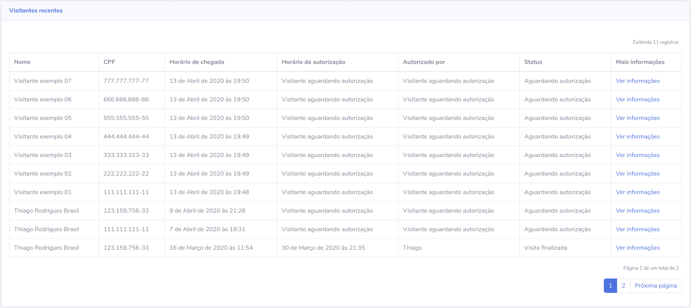

# Capítulo 15

## Paginando listagem de visitantes

Nossa dashboard está praticamente finalizada e pronta para ser entrega ao cliente. Criamos uma dashboard que lista os visitantes recentes e apresenta alguns dados de forma resumida na página inicial, registra novos visitantes, visualiza informações de visitantes e autoriza e finaliza as visitas. Além disso, criamos também toda a parte de login e logout para que os usuários possam se autenticar para visualizar as URLs que agora não mais permitem acessos não autenticados.

No decorrer do curso, aprendemos sobre diversas ferramentas que o Django framework nos dá e vimos como utilizá-las em um projeto do mundo real. A última ferramenta a ser conhecida e melhoria a ser implementada, será a paginação dos resultados dos visitantes recentes. Por agora, com poucos visitantes registrados, não temos problemas, mas pense se o banco de dados tiver 5000 registros de visitantes. Não seria interessante a gente buscar todo esse volume de dados de uma vez e muito menos exibí-los na template.

Pensando nisso, o Django possui a classe `Paginator`, que é quem vai nos ajudar a paginar os resultados do nosso banco de dados. Paginação é um processo conhecido que visa fatiar e exibir os resultados por páginas de quantidade a ser definida.


É comum, por exemplo, que as aplicações exibam 10 registros por vez e tenha links com o número das páginas para que você possa navegar nos resultados


Vamos conhecer essa classe e utilizá-la para paginar nossos visitantes de forma que a gente exiba 10 registros por vez.

## Conhecendo a classe Paginator

A classe `Paginator` do Django é quem abstrai toda a lógica necessária para paginar os resultados de uma queryset para nós. Tudo que precisamos é fornecer a queryset que vamos paginar e um valor inteiro que será a quantidade de itens que queremos por página. Antes de tudo, claro, vamos importar a classe em nossa arquivo `views.py` do aplicativo **dashboard**. Nosso bloco de importação ficará assim:

```python
from django.shortcuts import render
from django.contrib.auth.decorators import login_required
from django.core.paginator import Paginator

# código abaixo omitido
```

Agora que já podemos utilizar a classe `Paginator`, vamos criar a variável `visitantes_paginados` para guardar a instância da classe que criaremos passando a queryset `visitantes` e a quantidade de itens que queremos por página. 

```python
# paginando resultados para exibir de 10 em 10 itens
visitantes_paginados = Paginator(visitantes, 10)

numero_pagina = request.GET.get('page', 1)
pagina_obj = visitantes_paginados.get_page(numero_pagina)
```

Com isso, estamos criando uma instância da classe `Paginator` de nome `visitantes_paginados` e podemos utlizar alguns métodos da classe a partir dessa variável. Por agora, vamos utilizar somente o método `get_page`. Esse método recebe o número da página que queremos. Como temos os resultados divididos em páginas de 10 itens, podemos buscar uma página em específico. Por exemplo, se quiseremos buscar os itens da posição 11 até 20, podemos solicitar que o método `get_page` retorne a 2ª página.


A variável `numero_pagina` é quem vai nos ajudar a navegar pelos resultados paginados no lado do template. Vamos passar um valor através da URL da nossa dashboard, desta vez, utilizando o método `GET` e esse valor será enviado com o nome `page` na requisição. Mas não se preocupe, mais a frente vamos aprender como fazer isso.


Feito isso, vamos criar a variável `pagina_obj` que receberá o valor retornado pelo método `get_page` recebendo a variável `numero_pagina` como argumento. Com essas alterações feitas na view, agora precisamos apenas substituir a variável `visitantes` do contexto por `pagina_obj`, pois agora vamos consultar os valores já paginados para exibi-los no template.

```python
context = {
    "nome_pagina": "Página inicial",
    "visitantes_em_visita": visitantes_em_visita,
    "visitantes_aguardando": visitantes_aguardando,
    "visitantes_finalizado": visitantes_finalizado,
    "visitantes_mes": visitantes_mes,
    "pagina_obj": pagina_obj
}
```

## Alterando template para exibir resultados paginados

Agora vamos partir para o template `index.html` e antes de acessar qualquer página, vamos substituir a variável visitantes pela variável `pagina_obj`, pois vamos exibir os resultados que estiverem na página que buscamos.

```python
# alterar de:


# para:

```

Com isso feito, podemos agora acessar a URL [http://127.0.0.1:8000/](http://127.0.0.1:8000/) e verificar se está tudo como antes. Se tudo estiver sendo exibido corretamente, podemos seguir adiante.

## Adicionando links no template para navegar nos resultados

Ainda precisamos exibir no template alguns links para que seja possível navegar nas páginas em que nossos registros de visitantes foram divididos. Felizmente, a instância `pagina_obj` possui diversos métodos que podemos utilizar também nos templates para criar toda essa estrutura para o usuário.

Antes de tudo, vamos adicionar esse pequeno trecho de código acima do elemento `<div class="table-responsive">` para que ele nos mostre a quantidade total de registros que existem no banco de dados.

```markup
<p class="mr-2 text-right">
    <small>
        Exibindo {{ pagina_obj.paginator.count }} registros
    </small>
</p>
```

Além dessa informação, vamos exibir qual página está sendo exibida e qual o total de páginas existentes, além dos links para ir para a próxima ou voltar para a página anterior. Copie e cole o trecho de código abaixo logo após o elemento `<div class="table-responsive">` no template.

```markup
<nav aria-label="Page navigation example">
    <p class="mr-2 text-right">
        <small>
            Página {{ pagina_obj.number }} de um total de {{ pagina_obj.paginator.num_pages }}
        </small>
    </p>

    <ul class="pagination justify-content-end">
        
            <li class="page-item">
                <a class="page-link" href="?page={{ pagina_obj.previous_page_number }}" tabindex="-1">Página anterior</a>
            </li>
        

        
            
                <li class="page-item active">
                    <a class="page-link" href="">{{ numero_pagina }}</a>
                </li>
            
                <li class="page-item">
                    <a class="page-link" href="?page={{ numero_pagina }}">{{ numero_pagina }}</a>
                </li>
            
        

        
            <li class="page-item">
                <a class="page-link" href="?page={{ pagina_obj.next_page_number }}">Próxima página</a>
            </li>
        
    </ul>
</nav>
```

Com esse trecho de código montamos a estrutura responsável por exibir qual página está sendo exibida e o total de páginas existentes, além de criar os botões que possibilitam a navegação pelas páginas. Nosso primeiro passo aqui é exibir o número da página que está sendo exibida e a quantidade de páginas que temos e podemos extrair essas informações chamando os método `{{ pagina_obj.number }}` e `{{ pagina_obj.paginator.num_pages }}`.

Vamos também executar um `` no método `pagina_obj.paginator.page_range`, pois é ele quem irá nos dizer a quantidade de páginas que temos para exibir e, dentro do laço, criar a condição que renderiza o elemento `<li class="page-item">` como ativo ou não \(isso serve para que o CSS aplique a cor de fundo para o elemento que estiver ativo\). Note que os atributos `href` estão preenchidos como `"?page={{ numero_pagina }}"`, e estamos fazendo isso porque preparamos nossa view para receber uma variável de nome page que será a página a ser buscada. Dessa forma, conseguimos exibir a página

Os métodos `has_previous` e `has_next` servem para verificar se existem página anterior ou próxima com relação à página que estamos acessando. Vamos criar condições para verificar se existem as páginas e renderizar elementos `<li class="page-item">` que vão corresponder aos links para "página anterior" e "próxima página". O template ficará assim:



Com poucos itens não parece fazer diferença, mas se você registrar mais alguns visitantes, vai perceber que o template muda conforme a quantidade de registros. Experimente navegar nas páginas através dos botões que adicionamos.

