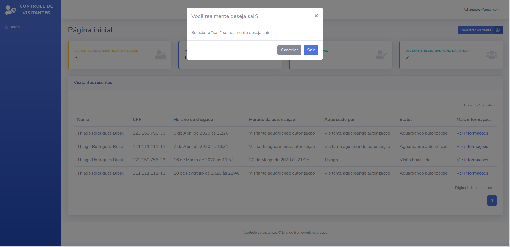

# Capítulo 16

## Bloqueando o acesso para usuários não autenticados nas nossas views

Estamos chegando na reta final do nosso projeto. Todos os requisitos descritos estão implementados e agora nós vamos cuidar de alguns requisitos que são chamados não funcionais. Esse tipo de requisito raramente é descrito mas está presente em praticamente todas as aplicações web existentes: telas de login, telas de logout e o bloqueio do acesso não autenticado a páginas com informações delicadas, por exemplo.

Daqui pra frente cuidaremos dos requisitos mencionados e vamos conhecer alguns recursos bem interessantes do Django que vão nos ajudar a poupar bastante tempo. O Django possui embutido em suas funcionalidades, alguns módulos voltados para a criação, administração e autenticação de usuários, conhecido por sistema de autenticação do Django. O comando `createsuperuser`, por exemplo, faz parte de suas funcionalidades.

Pense na dashboard que estamos criando: as informações que estamos exibindo ali são confidenciais e não devem ficar expostas para que qualquer um possa encontrá-las na web. Desta forma, nós precisamos bloquear as URLs para que somente usuários autenticados com e-mail e senha possam ter acesso e visualizar essas informações.

### Conhecendo o decorator login\_required

Para bloquear o acesso não autenticado às views, o Django nos fornece um caminho rápido para que a gente consiga implementar essa funcionalidade. Nós vamos utilizar o decorator `login_required` para tornar nossas views acessíveis somente após autenticação. Caso o usuário não esteja autenticado, não poderá acessar a view e será direcionado para uma tela de login.

Um decorator nada mais é que um método que envolve e modifica comportamentos de uma função. É isso que estamos fazendo: pedindo que o decorator `login_required` faça a função ser acessível somente após autenticação e, com isso, estamos alterando o comportamento da função.

Para utilizar esse decorator vamos primeiro importá-lo no topo do arquivo `views.py` do aplicativo dashboard:

```python
from django.shortcuts import render
from django.contrib.auth.decorators import login_required

# código abaixo omitido
```

Agora tudo que precisamos fazer é colocar um `@` antes do nome do decorator em cima da função `index`. O código ficará assim:

```python
@login_required
def index(request):
    
    todos_visitantes = Visitante.objects.order_by(
        "-horario_chegada"
    )

    # filtrando os visitantes por status
    visitantes_aguardando = todos_visitantes.filter(
        status="AGUARDANDO"
    )

    visitantes_em_visita = todos_visitantes.filter(
        status="EM_VISITA"
    )

    visitantes_finalizado = todos_visitantes.filter(
        status="FINALIZADO"
    )

    # filtrando visitantes por data (mês atual)
    hora_atual = timezone.now()
    mes_atual = hora_atual.month

    visitantes_mes = todos_visitantes.filter(
        horario_chegada__month=mes_atual
    )
    
    context = {
        "nome_pagina": "Início da dashboard",
        "todos_visitantes": todos_visitantes,
        "visitantes_aguardando": visitantes_aguardando.count(),
        "visitantes_em_visita": visitantes_em_visita.count(),
        "visitantes_finalizado": visitantes_finalizado.count(),
        "visitantes_mes": visitantes_mes.count(),
    }
    
    return render(request, "index.html", context)
```

Agora, se você tentar acessar a URL [http://127.0.0.1:8000/](http://127.0.0.1:8000/) sem estar autenticado, o Django irá exibir uma mensagem de erro. Esse erro ocorre porque quando utilizamos o decorator `login_required`, também é necessário configurar a URL de login e a URL para qual o usuário deverá ser direcionado após se autenticar.


Caso esteja autenticado, vá até o admin e clique em "encerrar sessão" ou cliquei nesse link: [http://127.0.0.1:8000/admin/logout/](http://127.0.0.1:8000/admin/logout/)


Vamos fazer isso em todas as view criadas que fazem parte da dashboard. São elas: `registrar_visitante`, `informacoes_visitante` e `finalizar_visita`.

## Alterando a URL padrão para login e redirecionamento após login

Agora que bloqueamos o acesso às views utilizando o decorator, precisamos definir as informações citadas anteriormente no arquivo `settings.py`. Vamos configurar as variáveis `LOGIN_URL` e `LOGIN_REDIRECT_URL`. e definir seus valores como `"login"` e `"index"`. O arquivo ficará assim:

```python
# código acima omitido
STATICFILES_DIRS = [
    os.path.join(BASE_DIR, "static")
]

LOGIN_URL = "login"
LOGIN_REDIRECT_URL = "index"
# código abaixo omitido
```

Não se preocupe com a URL login. Vamos criá-la no próximo passo.

## Utilizando o sistema de autenticação do Django para nos fornecer a view de login

Conforme dito, vamos utilizar o sistema de autenticação do Django para nos ajudar com todo código necessário para autenticar e deslogar os usuários da nossa dashboard. Para começar vamos abrir o arquivo `urls.py` e importar os seguinte módulo:

```python
from django.contrib import admin
from django.urls import path

from django.contrib.auth import views as auth_views

import dashboard.views
import visitantes.views

# código abaixo omitido
```

O que estamos fazendo é importar o arquivo de views do módulo `django.contrib.auth`. Fazendo isso, nós podemos utilizar as funções e classes disponíveis no módulo `django.contrib.auth.views`. Abaixo da função `path()` que define a URL para o admin, vamos definir a nossa URL de login:

```python
urlpatterns = [
    path("admin/", admin.site.urls),

    path(
        "login/",
        auth_views.LoginView.as_view(
            template_name="login.html"
        ),
        name="login"
    ),
    
    # código abaixo omitido
]
```

Como importamos o arquivo inteiro com o nome de `auth_views`, vamos acessar suas funções e classes por meio desse nome. Note que no lugar da view que deveríamos passar para a função `path()`, estamos passando uma classe existente no módulo `auth_views` e utilizando seu método `as_view()`. Esse método nos permite utilizar as views padrões do Django para autenticação que ainda nos permitem criar um template personalizado. O argumento `template_name` serve para que a gente diga para o Django qual template deve ser utilizado na view.

Com essa configuração, já temos uma URL de login. Agora precisamos de um template, claro.

## Criando o template de login

Vamos criar o arquivo `login.html` com o seguinte código:

```markup
<!DOCTYPE html>




<html lang="pt-br">
    <head>
        <meta charset="utf-8">
        <meta http-equiv="X-UA-Compatible" content="IE=edge">
        <meta name="viewport" content="width=device-width, initial-scale=1, shrink-to-fit=no">
        
        <title>Controle de Visitantes | Autenticação</title>
        
        <link href="https://fonts.googleapis.com/css?family=Nunito:200,200i,300,300i,400,400i,600,600i,700,700i,800,800i,900,900i" rel="stylesheet">
        
        <link href="" rel="stylesheet">    
        <link href="" rel="stylesheet" type="text/css">
    </head>

    <body class="bg-gradient-primary">
        <div class="container">
            <div class="row justify-content-center">
                <div class="col-xl-10 col-lg-12 col-md-9">
                    <div class="card o-hidden border-0 shadow-lg my-5">
                        <div class="card-body p-0">
                            <div class="row">
                                <div class="col-lg-6 d-none d-lg-block bg-login-image"></div>
    
                                <div class="col-lg-6">
                                    <div class="p-5">
                                        <div class="text-left mb-5">
                                            <h1 class="h4 text-gray-900 mb-1">Seja bem-vindo!</h1>
    
                                            <p>Faça login para continuar</p>
                                        </div>
    
                                        <form method="post" class="user">
                                            <p>ué cadê o formulário?</p>
    
                                            <button class="btn btn-primary btn-user btn-block" type="submit">
                                                <span class="text">Acessar dashboard</span>
                                            </button>
                                        </form>
                                    </div>
                                </div>
                            </div>
                        </div>
                    </div>
                    
                </div>
                
            </div>
        </div>
        
        <script src=""></script>
        <script src=""></script>
        <script src=""></script>
    </body>
</html>
```

Se você preferir, pode fazer download do arquivo zipado e colocar na pasta **templates** do seu projeto clicando no link abaixo:



### Renderizando formulário de login

Quando utilizamos a classe `LoginView` o Django nos dá tudo que precisamos para exibir o template, tratar a requisição, os possíveis erros do formulário e ainda autenticar o usuário. Junto disso tudo, temos a possibilidade de utilização da variável `form` que representa nosso formulário de autenticação.

Quando criamos nosso modelo personalizado de usuário, o Django preparou um formulário baseado nesse modelo, de forma bem parecida com que fizemos nos formulários que criamos. Vamos utilizar a mesma estratégia que utilizamos para renderizar o formulário de registro de visitante. O código do formulário ficará assim e deverá substituir o elemento `<p>` dentro do `<form>`:

```markup
<div class="form-row">
    
                        
    
        <div class="form-group col-md-12">
            
        </div>
    
</div>
```

Vamos acessar novamente a URL [http://127.0.0.1:8000/](http://127.0.0.1:8000/) e agora podemos notar que fomos direcionados para a tela de login que acabamos de criar. Essa é a nossa tela de login:


## Adicionando mensagem de erro em formulário de login

Agora que estamos exibindo nosso formulário, vamos adicionar só mais uma coisa no template: um alerta para caso o formulário retorne algum erro. Dessa vez vamos apenas informar que o e-mail ou a senha estão incorretos. O template completo ficará assim:

```markup
<!DOCTYPE html>




<html lang="pt-br">
    <head>
        <meta charset="utf-8">
        <meta http-equiv="X-UA-Compatible" content="IE=edge">
        <meta name="viewport" content="width=device-width, initial-scale=1, shrink-to-fit=no">
        
        <title>Controle de Visitantes | Autenticação</title>
        
        <link href="https://fonts.googleapis.com/css?family=Nunito:200,200i,300,300i,400,400i,600,600i,700,700i,800,800i,900,900i" rel="stylesheet">
        
        <link href="" rel="stylesheet">    
        <link href="" rel="stylesheet" type="text/css">
    </head>

    <body class="bg-gradient-primary">
        <div class="container">
            <div class="row justify-content-center">
                <div class="col-xl-10 col-lg-12 col-md-9">
                    <div class="card o-hidden border-0 shadow-lg my-5">
                        <div class="card-body p-0">
                            <div class="row">
                                <div class="col-lg-6 d-none d-lg-block bg-login-image"></div>
    
                                <div class="col-lg-6">
                                    <div class="p-5">
                                        <div class="text-left mb-5">
                                            <h1 class="h4 text-gray-900 mb-1">Seja bem-vindo!</h1>
    
                                            <p>Faça login para continuar</p>
                                        </div>
                                        
                                        
                                            <div class="alert alert-warning" role="alert">
                                                E-mail ou senha incorretos
                                            </div>
                                        
    
                                        <form method="post" class="user">
                                            <div class="form-row">
                                                
                                                                    
                                                
                                                    <div class="form-group col-md-12">
                                                        
                                                    </div>
                                                
                                            </div>
    
                                            <button class="btn btn-primary btn-user btn-block" type="submit">
                                                <span class="text">Acessar dashboard</span>
                                            </button>
                                        </form>
                                    </div>
                                </div>
                            </div>
                        </div>
                    </div>
                </div>
            </div>
        </div>
        
        <script src=""></script>
        <script src=""></script>
        <script src=""></script>
    </body>
</html>
```

Com o template finalizado, vamos novamente tentar acessar a URL [http://127.0.0.1:8000/](http://127.0.0.1:8000/). Dessa vez, quando formos direcionados para a tela de login, vamos utilizar as credenciais que criamos \(e-mail e senha\) e acessar o sistema.

## Criando URL para logout

Com a tela de login criada, vamos trabalhar para também criar a tela de logout, que será útil para quando o usuário quiser sair da dashboard. 

Antes de tudo, vamos criar a URL de `logout` quase da mesma forma com que criamos a URL de login. Vamos abrir o arquivo `urls.py` e utilizar a função `path` para criar a URL `logout`. O Código ficará assim:

```python
# código acima omitido

urlpatterns = [
    path("admin/", admin.site.urls),

    path(
        "login/",
        auth_views.LoginView.as_view(
            template_name="login.html"
        ),
        name="login"
    ),

    path(
        "logout/",
        auth_views.LogoutView.as_view(
            template_name="logout.html"
        ),
        name="logout"
    ),
    
    # código abaixo omitido
]
```

Note que dessa vez estamos utilizando a classe `LogoutView`.

## Criando template de logout

O processo será bem parecido com o executado para criação da URL da login. Como já criamos a URL, vamos agora partir para a criação do template que deverá ser exibido quando a URL `logout` for acessada. Vamos criar o arquivo `logout.html` na pasta templates com o seguinte código:

```markup
<!DOCTYPE html>




<html lang="pt-br">
    <head>
        <meta charset="utf-8">
        <meta http-equiv="X-UA-Compatible" content="IE=edge">
        <meta name="viewport" content="width=device-width, initial-scale=1, shrink-to-fit=no">
        
        <title>Controle de Visitantes | Logout</title>
        
        <link href="https://fonts.googleapis.com/css?family=Nunito:200,200i,300,300i,400,400i,600,600i,700,700i,800,800i,900,900i" rel="stylesheet">
        
        <link href="" rel="stylesheet">    
        <link href="" rel="stylesheet" type="text/css">
    </head>

    <body class="bg-gradient-primary">
        <div class="container">
            <div class="row justify-content-center">
                <div class="col-xl-10 col-lg-12 col-md-9">
                    <div class="card o-hidden border-0 shadow-lg my-5">
                        <div class="card-body p-0">
                            <div class="row">
                                <div class="col-lg-6 d-none d-lg-block bg-login-image"></div>
    
                                <div class="col-lg-6">
                                    <div class="p-5">
                                        <div class="text-left mb-5">
                                            <h1 class="h4 text-gray-900 mb-1">Até a próxima!</h1>
    
                                            <p>Você escolheu sair da dashboard, mas se preferir fazer login novamente, basta clicar no botão abaixo para voltar à página de login</p>
                                        </div>
    
                                        <a href="" class="btn btn-primary btn-user btn-block">
                                            <span class="text">Voltar para login</span>
                                        </a>
                                    </div>
                                </div>
                            </div>
                        </div>
                    </div>
                </div>
            </div>
        </div>
        
        <script src=""></script>
        <script src=""></script>
        <script src=""></script>
    </body>
</html>
```

Nosso template de logout exibe apenas uma mensagem dizendo que o usuário saiu do sistema e mostra um botão para ele voltar para a página de login, caso queira.

Mais uma vez, se você preferir, você pode fazer o download do arquivo zipado:



## Inserindo link para logout em dashboard

Se em algum momento anterior você clicou no ícone da engrenagem, no canto superior direito, descobriu o botão `sair`.  Ele abre um modal pedindo que o usuário confirme se realmente deseja sair:



Vamos inserir o link para a página logout no botão que confirma a ação que o usuário deseja sair. No template `base.html`, vamos procurar pelo modal de id `logoutModal` e depois o link "sair" dentro do elemento `<div class="modal-footer">`. O HTML do botão ficará assim:

```markup
<a class="btn btn-primary" href="">Sair</a>
```

Com isso, quando o usuário clicar no botão "sair" confirmando que deseja sair da dashboard, será direcionado para a página de logout.


