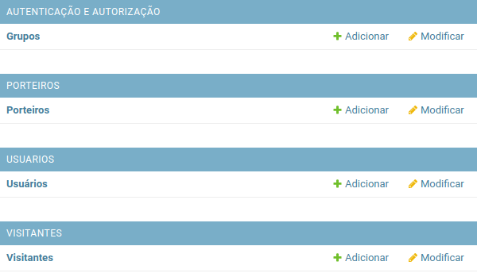
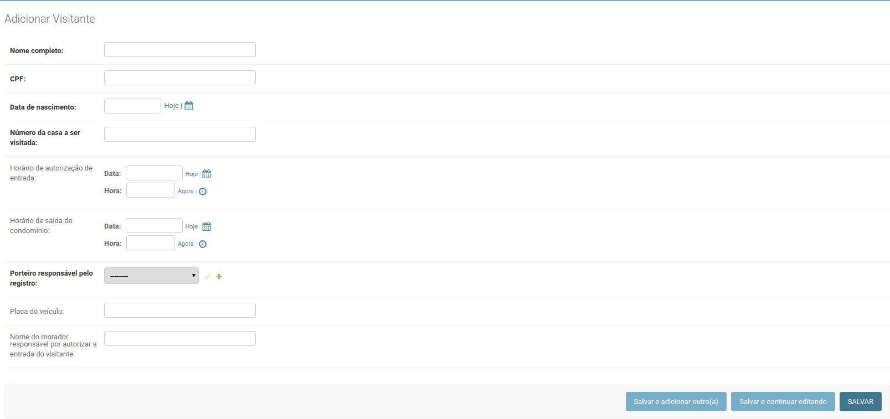

# Módulo 05 - dev

## Criando o aplicativo para gerenciar visitantes

No último capítulo configuramos o Django para trabalhar com templates HTML e criamos a pasta **templates** na raíz do projeto. Além disso, ainda aprendemos como passar informações de uma função _view_ para o template através da variável **contexto**.

Como já definimos os usuários do sistema, os porteiros e fizemos as configurações dos templates que serão a base para construção da dashboard para controle de visitantes, podemos partir agora para definição do modelo de visitante.

Antes de mais nada, como já sabemos, devemos isolar as responsabilidades e, por isso, vamos criar um aplicativo para administrar toda a parte referente aos nossos visitantes. Vamos criar um novo aplicativo com nome de **visitantes** utilizando o `manage.py`:

```text
(env)$ python manage.py startapp visitantes
```

Após criarmos o aplicativo utilizando o `manage.py`, vamos registrá-lo no arquivo de configurações, o `settings.py`, logo abaixo do aplicativo **porteiros**:

```python
INSTALLED_APPS += [
    "usuarios",
    "porteiros",
    "visitantes",
]
```

Feito isso, vamos começar os trabalhos no arquivos `models.py` para definirmos as informações necessárias para nosso modelo de visitante.

## Escrevendo as models do nosso aplicativo de visitantes

Conforme falamos, a camada _model_ ****\(ou camada de modelo\) é nossa fonte segura de dados e onde definimos o formato das informações que serão disponibilizadas para outras camadas da aplicação. Ou seja, é hora de definirmos quais informações dos nossos visitantes desejamos guardar.

A partir do documento de requisitos, podemos concluir que é necessário guardar uma série de informações a respeito de quem deseja adentrar ao condomínio para realizar visitas a moradores, além da autorização de um morador que esteja na casa no momento da visita. O procedimento faz parte de normas do condomínio para fins de fiscalização, controle e segurança dos moradores. Segundo normas do condomínio, devemos guardar as seguintes informações referentes à visita:

1. Nome completo do visitante
2. CPF do visitante
3. Data de nascimento do visitante
4. Número da casa a ser visitada
5. Placa do veículo utilizado na visita, se houver
6. Horário de chegada na portaria
7. Horário de saída do condomínio
8. Horário de autorização de entrada
9. Nome do morador responsável por autorizar a entrada do visitante
10. Porteiro responsável por registrar visitante

Inicialmente, vamos nos concentrar nas informações de 1 a 7 para que possamos avaliar e escrever por partes o modelo de visitantes. Vamos escrever primeiro os atributos nome completo, CPF, data de nascimento, número da casa e placa do veículo, pois são todos tipos de dados que já conhecemos. Nossa classe `Visitante` ficará assim:

```python
from django.db import models

class Visitante(models.Model):
    nome_completo = models.CharField(
        verbose_name="Nome completo", max_length=194
    )

    cpf = models.CharField(
        verbose_name="CPF",
        max_length=11,
    )

    data_nascimento = models.DateField(
        verbose_name="Data de nascimento",
        auto_now=False
    )

    numero_casa = models.CharField(
        verbose_name="Número da casa a ser visitada",
        max_length=3,
    )

    placa_veiculo = models.CharField(
        verbose_name="Placa do veículo",
        max_length=10,
        blank=True,
        null=True,
    )
```

### Conhecendo o campo DateTimeField

Antes de prosseguirmos, precisamos conhecer o campo `DateTimeField`, um cara bem parecido com o `DateField` que já conhecemos com a diferença que, além da data, salva também o horário exato do registro. Assim como o `DateField`, o `DateTimeField` aceita `auto_now` e `auto_now_add` como argumentos, além das opções `blank` e `null`. Vamos utilizar o `DateTimeField` para definirmos os atributos que vão representar o horário de chegada e o horário de saída do visitante.

Primeiro vamos definir o atributo `horario_chegada`, que é quem representa o horário de chegada do visitante à portaria do condomínio. Como o atributo representa o horário de chegada do visitante à portaria, faz sentido que o mesmo seja preenchido no exato momento que registrarmos o visitante em nosso sistema. Para isso, utilizaremos a opção `auto_now_add` com o valor `True`, assim garantimos que o atributo receberá o valor da hora atual assim que o registro for adicionado ao banco de dados.

```python
from django.db import models

class Visitante(models.Model):
    # código acima omitido...

    placa_veiculo = models.CharField(
        verbose_name="Placa do veículo",
        max_length=10,
        blank=True,
        null=True,
    )
    
    horario_chegada = models.DateTimeField(
        verbose_name="Horário de chegada na portaria", auto_now_add=True
    )
```

Para o caso do horário de saída, utilizaremos uma configuração diferente para o atributo. Como precisamos setar o valor somente após a saída do visitante do condomínio, esse valor precisa ser registrado inicialmente como um valor em branco. Para isso, o Django nos dá a possibilidade de utilização do atributo `auto_now` como `False`. Desta forma, o campo receberá um valor em branco no momento da criação do registro no banco de dados.

```python
from django.db import models

class Visitante(models.Model):
    # código acima omitido...

    placa_veiculo = models.CharField(
        verbose_name="Placa do veículo",
        max_length=10,
        blank=True,
        null=True,
    )
    
    horario_chegada = models.DateTimeField(
        verbose_name="Horário de chegada na portaria",
        auto_now_add=True
    )
    
    horario_saida = models.DateTimeField(
        verbose_name="Horário de saída do condomínio",
        auto_now=False,
    )
```

Conforme visto, além destas informações, precisamos guardar também o nome do morador que autorizou a entrada do visitante e o horário da autorização. Sendo assim, teremos mais dois atributos:

* Horário de autorização de entrada
* Nome do morador responsável por autorizar a entrada do visitante

Utilizaremos os campos já conhecidos `DateTimeField` e `CharField` para criarmos os atributos:

```python
from django.db import models

class Visitante(models.Model):
    # código acima omitido...
    
    horario_saida = models.DateTimeField(
        verbose_name="Horário de saída do condomínio",
        auto_now=False,
    )
    
    horario_autorizacao = models.DateTimeField(
        verbose_name="Horário de autorização de entrada",
        auto_now=False,
    )
    
    morador_resposavel = models.CharField(
        verbose_name="Nome do morador responsável por autorizar a entrada do visitante",
        max_length=194,
        blank=True,
    )
```

Nada de novo por enquanto: utilizamos um campo do tipo `CharField` para armazenar o nome do morador responsável por autorizar a entrada e utilizamos um `DateTimeField` para armazenar o horário em que a autorização ocorreu. Conforme vimos, se não queremos que o campo `DateTimeField` seja preenchido na hora da criação ou atualização do registro, setamos o argumento `auto_now` como `False`. Isso garante também que o campo possa ser preenchido com um texto vazio.

### Conhecendo o campo ForeignKey

Seguindo a lista de requisitos, o próximo atributo que devemos adicionar ao nosso modelo é a informação referente ao **porteiro responsável por registrar a entrada do visitante**.

Como criamos um modelo que representa nossos porteiros dentro do sistema, podemos associar esse modelo ao modelo de **visitante** por meio do campo `ForeignKey`. Esse campo cria um atributo que vincula um registro de modelo a outro registro de modelo. Neste caso, queremos vincular o modelo `Porteiro` ao modelo `Visitante` para representar o porteiro responsável pelo registro.

O campo `ForeignKey` é importante pois assim não precisamos replicar as informações do porteiro no registro de visitante, apenas referenciamos essas informações inserindo o `id` referente ao registro do **porteiro**. Como os modelos são representações das tabelas do nosso banco de dados, estamos dizendo algo como: _"hey, Django, procure essas informações na tabela de porteiros usando esse id!"_ e o Django faz todo o trabalho de trazer essas informações por nós.

Abaixo do atributo `morador_resposavel`, vamos escrever o atributo  `registrado_por` sendo do tipo `ForeignKey`, que representará a informação do **porteiro** responsável por registrar a entrada do visitante:

```python
from django.db import models

class Visitante(models.Model):
    # código acima omitido...
    
    morador_resposavel = models.CharField(
        verbose_name="Nome do morador responsável por autorizar a entrada do visitante",
        max_length=194,
        blank=True,
    )
    
    registrado_por = models.ForeignKey(
        "porteiros.Porteiro",
        verbose_name="Porteiro responsável pelo registro",
        on_delete=models.PROTECT
    )
```

Os argumentos que o campo `ForeignKey` recebe são bem parecidos com os do `OneToOneField` que já conhecemos. Primeiro informamos a classe modelo que deverá ser relacionada: a classe `Porteiro` do aplicativo **porteiros**, no caso. Depois damos um nome descritivo para o campo e depois informamos o que deve ser feito com o registro do visitante caso o registro do **porteiro** da relação seja excluído. Nesse caso, utilizaremos para o `on_delete` a ação `models.PROTECT`, pois assim protegemos também o modelo de visitantes. Sempre que houver tentativa de exclusão de um registro de porteiro que esteja vinculado a um visitante, o Django mostrará um erro. O atributo está protegido contra exclusão.

Feito isso, nosso próximo passo será apenas escrever a classe `Meta` e o método `__str__` da classe Visitante. Nosso modelo ficará assim:

```python
from django.db import models

class Visitante(models.Model):
    nome_completo = models.CharField(
        verbose_name="Nome completo", max_length=194
    )

    cpf = models.CharField(
        verbose_name="CPF",
        max_length=11,
    )

    data_nascimento = models.DateField(
        verbose_name="Data de nascimento",
        auto_now=False
    )

    numero_casa = models.CharField(
        verbose_name="Número da casa a ser visitada",
        max_length=3,
    )

    placa_veiculo = models.CharField(
        verbose_name="Placa do veículo",
        max_length=10,
        blank=True,
        null=True,
    )
    
    horario_chegada = models.DateTimeField(
        verbose_name="Horário de chegada na portaria",
        auto_now_add=True
    )
    
    horario_saida = models.DateTimeField(
        verbose_name="Horário de saída do condomínio",
        auto_now=False,
    )
    
    horario_autorizacao = models.DateTimeField(
        verbose_name="Horário de autorização de entrada",
        auto_now=False,
    )
    
    morador_resposavel = models.CharField(
        verbose_name="Nome do morador responsável por autorizar a entrada do visitante",
        max_length=194,
        blank=True,
    )

    registrado_por = models.ForeignKey(
        "porteiros.Porteiro",
        verbose_name="Porteiro responsável pelo registro",
        on_delete=models.PROTECT
    )
    
    class Meta:
        verbose_name = "Visitante"
        verbose_name_plural = "Visitantes"
        db_table = "visitante"

    def __str__(self):
        return self.nome_completo
```

## Registrando nossa aplicação no Admin do Django

O próximo passo a ser executado, como já vimos, é tornar o nosso modelo visível para o Admin do Django. Então vamos lá!

Vamos abrir o arquivo `admin.py` do nosso aplicativo visitantes, importar a classe `Visitante` e passá-la como argumento da função `admin.site.register()`.

```python
from django.contrib import admin
from visitantes.models import Visitante

admin.site.register(Visitante)
```

## Aplicando as alterações em nosso banco de dados

Feito isso, mais uma vez vamos criar as migrações do modelo criado utilizando o comando `makemigrations`.

```python
(env)$ python manage.py makemigrations visitantes
```

Se tudo ocorrer bem, vamos receber as seguintes informações em nosso terminal:

```python
Migrations for 'visitantes':
  porteiros/migrations/0001_initial.py
    - Create model Visitante
```

Com todas as informações necessárias para executar as alterações no banco de dados armazenadas em forma de migração, vamos aplicar as alterações em nosso banco de dados com o comando `migrate`.

```python
(env)$ python manage.py migrate visitantes
```

Devemos receber as seguintes informações em nosso terminal:

```python
Operations to perform:
  Apply all migrations: visitantes

Running migrations:
  Applying visitantes.0001_initial.py... OK
```

## Adicionando visitante utilizando o Django Admin

Da mesma forma que cadastramos um porteiro utilizando o Admin do Django, vamos adicionar também um visitante. Vamos novamente acessar [http://127.0.0.1:8000/admin](http://127.0.0.1:8000/admin) e agora veremos o aplicativo **visitantes** disponível para nós.



Dessa vez, vamos clicar diretamente no botão "adicionar" para que a gente vá direto para o formulário de cadastro de visitantes. O formulário a ser exibido deverá se parecer com isto:



Por enquanto vamos preencher os campos obrigatórios **nome completo**, **CPF**, **data de nascimento** e **número da casa** a ser visitada e **porteiro** responsável por registro o visitante. Fique livre para preencher as informações à sua maneira. 

Após preencher os campos citados, clique em salvar e visualize a lista de visitantes agora com o novo visitante registrado.

Essa foi a primeira e última vez utilizamos o Django Admin para registar um visitante, pois a partir de agora trabalharemos diretamente nos templates HTML da dashboard que vamos disponibilizar para os porteiros do condomínio.

## Listando visitantes na página inicial da dashboard

Como já definimos nosso modelo e até registramos um visitante através do Admin, agora vamos aprender como buscar esses registros em nosso banco de dados.

Quando precisamos buscar registros em nosso banco de dados, devemos construir uma **Queryset** utilizando o **Manager** da classe modelo em questão. A classe Manager, conforme visto, define como as interações com o banco de dados devem acontecer e, por padrão, é um atributo da classe chamado `objects`. Já uma queryset nada mais é que uma coleção de objetos existentes em nosso banco de dados. 

Sempre que definimos uma subclasse de `django.db.models.Model`, que é o que todos os nossos modelos são, o Django nos fornece de forma automática uma interface para realizar operações em nosso banco de dados, tais como buscar, atualizar, criar e deletar registros. Por hora, vamos nos concentrar em buscar os registros de visitantes existentes em nosso banco de dados.

### Buscando registros de visitantes no banco de dados

Quando falamos da camada **view**, vimos que é ela quem deve escapsular toda a lógica necessária para apresentar os dados necessários. Geralmente, as **views** devem buscar as informações no banco de dados, carregar o template e renderizar esse template com as informações buscadas. Uma view no Django tem a função de exatamente conectar a camada de modelo à camada de template, de modo que as responsabilidades fiquem isoladas.

O primeiro passo para buscarmos os registros de visitantes é...

```python
todos_visitantes = Visitante.objects.all()
```

### Listando registros de visitantes no HTML

Conhecendo a tag for

Acessando atributos do visitante 

